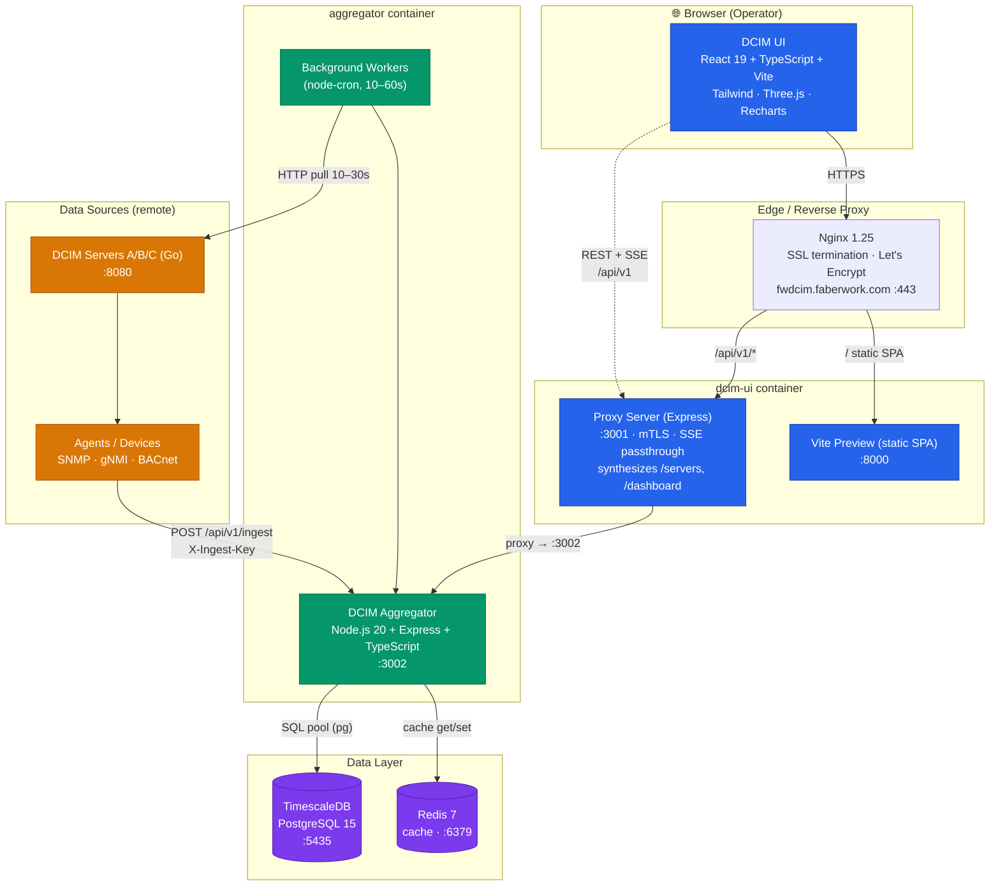
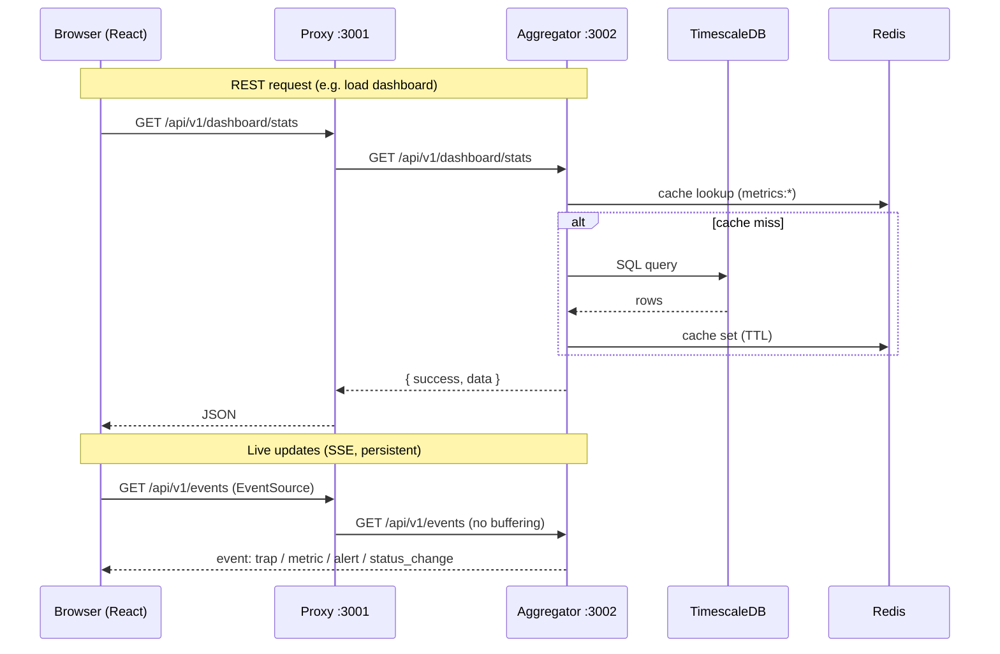
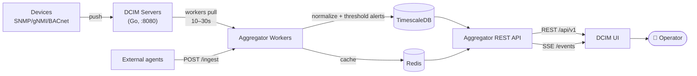

# DCIM Platform — Architecture & Tech Stack

How **DCIM Aggregator** (backend) and **DCIM UI** (frontend) are built and interconnected.

---

## 1. High-Level Architecture



---

## 2. The Interconnect — How UI talks to Aggregator

The UI **never hits the Aggregator directly**. Every call flows: **UI → Proxy (:3001) → Aggregator (:3002)**. This lets the proxy add mTLS, stream SSE without buffering, and synthesize a few endpoints.



**Resolution of the API base URL** (`DCIM_UI/src/lib/api.ts`):
```
VITE_AGGREGATOR_URL  ||  VITE_API_URL  ||  '/api/v1'
```
In Docker the UI uses the relative `/api/v1`, which Nginx routes to the proxy, which forwards to `http://aggregator:3002`.

| Concern | Mechanism |
|---|---|
| Request/response | `fetch` wrapper (`APIClient`), envelope `{ success, data, message }` |
| Polling | TanStack React Query — `staleTime 30s`, dashboards `refetchInterval 10–15s` |
| Live push | **SSE** via `EventSource` (`src/lib/sse.ts`), reconnect backoff 5→60s |
| Auth | Session user object in Zustand → persisted to `localStorage` (`dcim-auth`) |

---

## 3. Tech Stack

### DCIM UI (Frontend)
| Layer | Technology |
|---|---|
| Framework | **React 19.2** + **TypeScript 5.9** |
| Build / dev | **Vite 7** (dev :5173, preview :8000) |
| Routing | React Router DOM 7 |
| Styling / UI | Tailwind CSS 4 · Radix UI · shadcn/ui · Lucide icons |
| State | **Zustand 5** (persist middleware) |
| Data fetching | **TanStack React Query 5** |
| Charts | Recharts 3 · D3 7 |
| 3D | **Three.js** · @react-three/fiber · drei (3D topology & fire-safety) |
| Graph layout | Dagre 3 (2D topology) |
| Real-time | EventSource (SSE) |
| Edge proxy | Express proxy server (`proxy-server.js`, :3001) |

### DCIM Aggregator (Backend)
| Layer | Technology |
|---|---|
| Runtime | **Node.js 20** + **TypeScript 5.3** |
| Web framework | **Express 4** (:3002) |
| Database driver | `pg` 8 → **PostgreSQL 15 / TimescaleDB** (pool max 20) |
| Cache | `redis` 4 → **Redis 7** (TTL cache, health snapshots) |
| Scheduler | **node-cron** (6 background workers) |
| HTTP client | axios (pulls from DCIM Servers, mTLS cert pinning) |
| Live events | Server-Sent Events emitter |
| Logging | Winston |
| Ingest auth | `X-Ingest-Key` header → `INGEST_API_KEY` |

### Infrastructure (`docker-compose.yml`)
`timescaledb` (5435) · `redis` (6379) · `aggregator` (3002) · `dcim-ui` (8000/3001) · `nginx` (80/443) · `certbot` · `pgadmin` (5050)

---

## 4. Data Flow End-to-End



**Ingestion** — agents `POST /api/v1/ingest` (devices, interfaces, metrics, energy_metrics, topology_links, events). Workers also **poll** remote DCIM Servers every 10–30s.

**Six cron workers:** metrics sync (10s) · agents sync (30s) · alerts sync (30s) · traps sync (30s) · health monitor (60s) · topology-links sync (60s). Metrics crossing thresholds auto-generate alert events.

**Key tables:** `devices`, `interfaces`, `metrics`, `energy_metrics` (hypertable), `events`, `topology_links`, `users`, `tickets`.

---

## 5. What Each Side Owns

| DCIM UI | DCIM Aggregator |
|---|---|
| Render dashboards, 2D/3D topology, energy, fire-safety | Ingest & normalize device data |
| Poll (React Query) + subscribe (SSE) | Serve REST `/api/v1/*` + SSE `/events` |
| Session auth, routing, charts | Run 6 sync workers, auto-alerting |
| Talks **only** through the proxy | Owns TimescaleDB + Redis, threshold logic |

**The seam between them:** `/api/v1` REST for request/response + `/api/v1/events` SSE for live push, brokered by the Express proxy on :3001.
