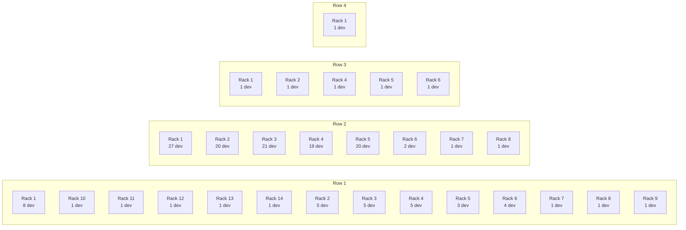
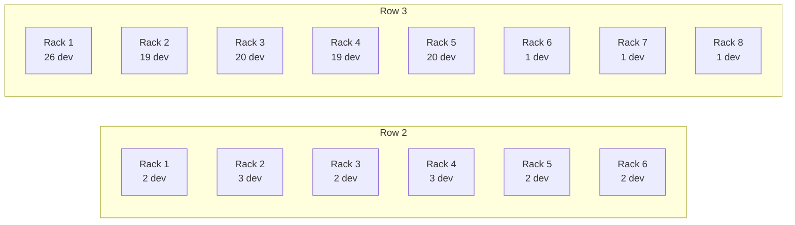
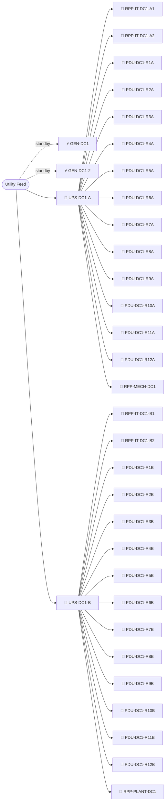
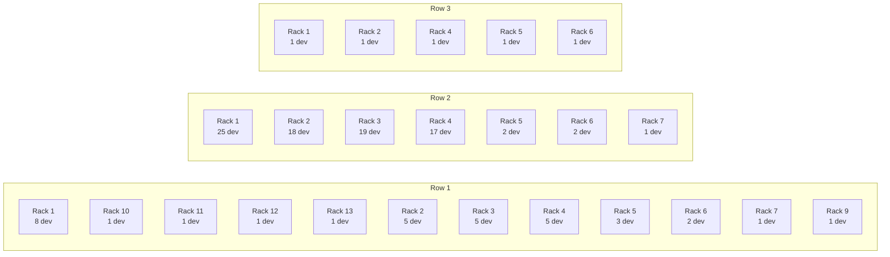
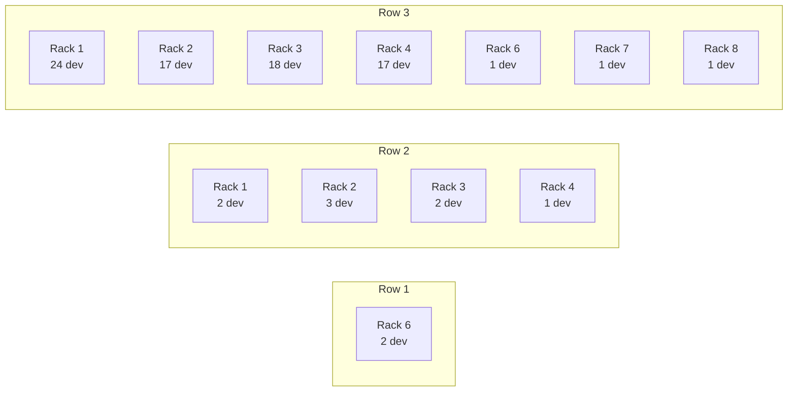
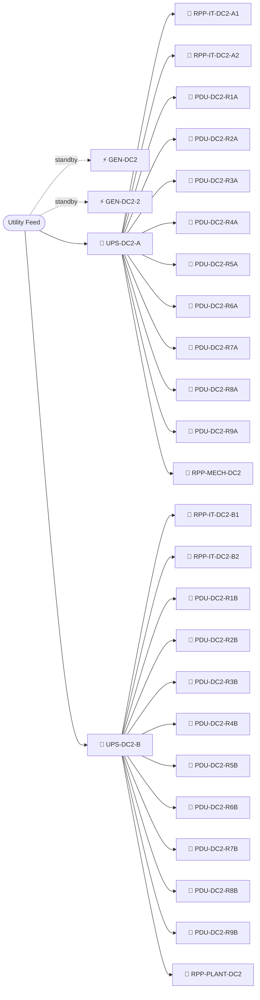
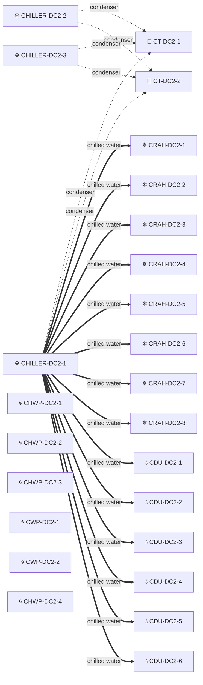

# Dual-DC Enterprise — Physical Layout

## 1. Inventory Summary

| Device Type | Count |
|---|---:|
| 🖥 Server | 308 |
| 🌡 Sensor | 63 |
| 🔌 PDU | 42 |
| 🔁 Switch | 29 |
| ❄ CRAH | 16 |
| 📊 Energy Monitor | 14 |
| 🛠 OOB Switch | 13 |
| 🔌 RPP | 12 |
| 🌀 Pump | 12 |
| 💧 CDU | 12 |
| ❄ Chiller | 6 |
| 🔀 Router | 4 |
| 🧱 Firewall | 4 |
| ⚖ Load Balancer | 4 |
| ⚡ Generator | 4 |
| 🔋 UPS | 4 |
| 🗼 Cooling Tower | 4 |
| 🚰 Valve | 4 |
| **Total** | **555** |

| Datacenter | City | Country | Devices |
|---|---|---|---:|
| DC1 | Chicago | USA | 310 |
| DC2 | New York | USA | 245 |

## 2. Site Hierarchy

```mermaid
flowchart TD
  ROOT([Enterprise]) 
  ROOT --> DC1[DC1 · Chicago]
  DC1 --> DC1_CentralPlant[🏭 Central Plant]
  DC1 --> DC1_GeneratorRoom[🏭 Generator Room]
  DC1 --> DC1_MechanicalRoom[🏭 Mechanical Room]
  DC1 --> DC1_Roof[🏭 Roof]
  DC1 --> DC1_ServerHallA[🏢 Server Hall A]
  DC1 --> DC1_ServerHallB[🏢 Server Hall B]
  DC1 --> DC1_UpsRoom[🏭 UPS Room]
  DC1 --> DC1_UnderFloor[🏭 Under Floor]
  ROOT --> DC2[DC2 · New York]
  DC2 --> DC2_CentralPlant[🏭 Central Plant]
  DC2 --> DC2_GeneratorRoom[🏭 Generator Room]
  DC2 --> DC2_MechanicalRoom[🏭 Mechanical Room]
  DC2 --> DC2_Roof[🏭 Roof]
  DC2 --> DC2_ServerHallA[🏢 Server Hall A]
  DC2 --> DC2_ServerHallB[🏢 Server Hall B]
  DC2 --> DC2_UpsRoom[🏭 UPS Room]
  DC2 --> DC2_UnderFloor[🏭 Under Floor]
```

Legend: 🏢 = IT white-space (racks of compute/network) · 🏭 = facility / MEP space (power & cooling plant).

## 3. DC1 — Chicago, USA

### Rooms & Floors

| Room | Floor(s) | Rows | Racks | Devices |
|---|---|---:|---:|---:|
| Central Plant | 1 | 2 | 3 | 20 |
| Generator Room | G | 2 | 3 | 3 |
| Mechanical Room | G | 1 | 1 | 2 |
| Roof | Roof | 1 | 1 | 2 |
| Server Hall A | 1 | 4 | 28 | 155 |
| Server Hall B | 2 | 2 | 14 | 121 |
| UPS Room | G | 1 | 2 | 2 |
| Under Floor | 1, 2 | 4 | 4 | 5 |

### Server Hall A — Rack Elevations

#### Floor 1

<b>Row 1 · Rack 1</b> — 8 devices

| RU | Device | Type | Model | Power (W) | Feed A | Feed B |
|---:|---|---|---|---:|---|---|
| 42 | DC1-ER1 | 🔀 Router | Cisco ASR 1001-X | 387 | PDU-DC1-R6A | PDU-DC1-R6B |
| 40 | DC1-ER2 | 🔀 Router | Cisco ASR 1001-X | 379 | PDU-DC1-R7A | PDU-DC1-R7B |
| 1 | SENSOR-DC1-01 | 🌡 Sensor | Raritan DPX2-T3H1 | 5 | PDU-DC1-R1A | PDU-DC1-R1B |
| 1 | PDU-DC1-R1B | 🔌 PDU | Raritan PX3-5190R | 0 |  |  |
| 0 | PDU-DC1-R1A | 🔌 PDU | APC AP8681 | 0 |  |  |
| 0 | SENS-DC1-CDU1-LEAK | 🌡 Sensor | Raritan DPX2-CC2 | 9 |  |  |
| 0 | SENS-DC1-CDU2-LEAK | 🌡 Sensor | Raritan DPX2-CC2 | 9 |  |  |
| 0 | SENS-DC1-CDU3-LEAK | 🌡 Sensor | Raritan DPX2-CC2 | 9 |  |  |

<b>Row 1 · Rack 10</b> — 1 devices

| RU | Device | Type | Model | Power (W) | Feed A | Feed B |
|---:|---|---|---|---:|---|---|
| 42 | OOB-SW-DC1-01 | 🛠 OOB Switch | Cisco Catalyst 1000-48T | 62 | PDU-DC1-R1A | PDU-DC1-R1B |

<b>Row 1 · Rack 11</b> — 1 devices

| RU | Device | Type | Model | Power (W) | Feed A | Feed B |
|---:|---|---|---|---:|---|---|
| 42 | OOB-SW-DC1-02 | 🛠 OOB Switch | Cisco Catalyst 1000-48T | 99 | PDU-DC1-R4A | PDU-DC1-R4B |

<b>Row 1 · Rack 12</b> — 1 devices

| RU | Device | Type | Model | Power (W) | Feed A | Feed B |
|---:|---|---|---|---:|---|---|
| 42 | OOB-SW-DC1-03 | 🛠 OOB Switch | Cisco Catalyst 1000-48T | 67 | PDU-DC1-R7A | PDU-DC1-R7B |

<b>Row 1 · Rack 13</b> — 1 devices

| RU | Device | Type | Model | Power (W) | Feed A | Feed B |
|---:|---|---|---|---:|---|---|
| 42 | OOB-SW-DC1-04 | 🛠 OOB Switch | Cisco Catalyst 1000-48T | 67 | PDU-DC1-R9A | PDU-DC1-R9B |

<b>Row 1 · Rack 14</b> — 1 devices

| RU | Device | Type | Model | Power (W) | Feed A | Feed B |
|---:|---|---|---|---:|---|---|
| 42 | OOB-SW-DC1-05 | 🛠 OOB Switch | Cisco Catalyst 1000-48T | 66 | PDU-DC1-R12A | PDU-DC1-R12B |

<b>Row 1 · Rack 2</b> — 5 devices

| RU | Device | Type | Model | Power (W) | Feed A | Feed B |
|---:|---|---|---|---:|---|---|
| 42 | DC1-FW1 | 🧱 Firewall | PA-5220 | 341 | PDU-DC1-R6A | PDU-DC1-R6B |
| 40 | DC1-FW2 | 🧱 Firewall | PA-5220 | 327 | PDU-DC1-R7A | PDU-DC1-R7B |
| 1 | PDU-DC1-R2B | 🔌 PDU | Raritan PX3-5190R | 0 |  |  |
| 0 | SENSOR-DC1-02 | 🌡 Sensor | Vertiv Geist GTHD | 8 | PDU-DC1-R2A | PDU-DC1-R2B |
| 0 | PDU-DC1-R2A | 🔌 PDU | APC AP8681 | 0 |  |  |

<b>Row 1 · Rack 3</b> — 5 devices

| RU | Device | Type | Model | Power (W) | Feed A | Feed B |
|---:|---|---|---|---:|---|---|
| 42 | DC1-LB1 | ⚖ Load Balancer | BIG-IP i5800 | 291 | PDU-DC1-R6A | PDU-DC1-R6B |
| 40 | DC1-LB2 | ⚖ Load Balancer | BIG-IP i5800 | 285 | PDU-DC1-R7A | PDU-DC1-R7B |
| 1 | SENSOR-DC1-03 | 🌡 Sensor | APC NetBotz 355 | 9 | PDU-DC1-R2A | PDU-DC1-R2B |
| 1 | PDU-DC1-R3B | 🔌 PDU | Raritan PX3-5190R | 0 |  |  |
| 0 | PDU-DC1-R3A | 🔌 PDU | APC AP8681 | 0 |  |  |

<b>Row 1 · Rack 4</b> — 5 devices

| RU | Device | Type | Model | Power (W) | Feed A | Feed B |
|---:|---|---|---|---:|---|---|
| 42 | DC1-CORE1 | 🔁 Switch | Cisco Nexus 9364C | 256 | PDU-DC1-R6A | PDU-DC1-R6B |
| 40 | DC1-CORE2 | 🔁 Switch | Cisco Nexus 9364C | 230 | PDU-DC1-R7A | PDU-DC1-R7B |
| 1 | PDU-DC1-R4B | 🔌 PDU | Raritan PX3-5190R | 0 |  |  |
| 0 | SENSOR-DC1-04 | 🌡 Sensor | APC NetBotz 250 | 8 | PDU-DC1-R3A | PDU-DC1-R3B |
| 0 | PDU-DC1-R4A | 🔌 PDU | APC AP8681 | 0 |  |  |

<b>Row 1 · Rack 5</b> — 3 devices

| RU | Device | Type | Model | Power (W) | Feed A | Feed B |
|---:|---|---|---|---:|---|---|
| 42 | DC1-SP1 | 🔁 Switch | Cisco Nexus 93180YC-FX | 229 | PDU-DC1-R4A | PDU-DC1-R4B |
| 1 | PDU-DC1-R5B | 🔌 PDU | Raritan PX3-5190R | 0 |  |  |
| 0 | PDU-DC1-R5A | 🔌 PDU | APC AP8681 | 0 |  |  |

<b>Row 1 · Rack 6</b> — 4 devices

| RU | Device | Type | Model | Power (W) | Feed A | Feed B |
|---:|---|---|---|---:|---|---|
| 42 | DC1-SP2 | 🔁 Switch | Cisco Nexus 93180YC-FX | 221 | PDU-DC1-R6A | PDU-DC1-R6B |
| 1 | SENSOR-DC1-06 | 🌡 Sensor | Raritan DPX2-T3H1 | 6 | PDU-DC1-R4A | PDU-DC1-R4B |
| 1 | PDU-DC1-R6B | 🔌 PDU | Raritan PX3-5190R | 0 |  |  |
| 0 | PDU-DC1-R6A | 🔌 PDU | APC AP8681 | 0 |  |  |

<b>Row 1 · Rack 7</b> — 1 devices

| RU | Device | Type | Model | Power (W) | Feed A | Feed B |
|---:|---|---|---|---:|---|---|
| 42 | DC1-SP3 | 🔁 Switch | Cisco Nexus 93180YC-FX | 228 | PDU-DC1-R7A | PDU-DC1-R7B |

<b>Row 1 · Rack 8</b> — 1 devices

| RU | Device | Type | Model | Power (W) | Feed A | Feed B |
|---:|---|---|---|---:|---|---|
| 42 | DC1-SP4 | 🔁 Switch | Cisco Nexus 93180YC-FX | 219 | PDU-DC1-R9A | PDU-DC1-R9B |

<b>Row 1 · Rack 9</b> — 1 devices

| RU | Device | Type | Model | Power (W) | Feed A | Feed B |
|---:|---|---|---|---:|---|---|
| 42 | OOB-CORE-DC1 | 🛠 OOB Switch | Cisco Catalyst 9300-48T | 94 | PDU-DC1-R7A | PDU-DC1-R7B |

<b>Row 2 · Rack 1</b> — 27 devices

| RU | Device | Type | Model | Power (W) | Feed A | Feed B |
|---:|---|---|---|---:|---|---|
| 42 | DC1-LF01 | 🔁 Switch | Cisco Nexus 93180YC-FX | 254 | PDU-DC1-R3A | PDU-DC1-R3B |
| 35 | DC1-DHCP1 | 🖥 Server |  | 525 | PDU-DC1-R4A | PDU-DC1-R4B |
| 33 | DC1-SRV017 | 🖥 Server |  | 519 | PDU-DC1-R5A | PDU-DC1-R5B |
| 31 | DC1-SRV016 | 🖥 Server |  | 605 | PDU-DC1-R5A | PDU-DC1-R5B |
| 29 | DC1-SRV015 | 🖥 Server |  | 608 | PDU-DC1-R5A | PDU-DC1-R5B |
| 27 | DC1-SRV014 | 🖥 Server |  | 754 | PDU-DC1-R5A | PDU-DC1-R5B |
| 25 | DC1-SRV013 | 🖥 Server |  | 677 | PDU-DC1-R4A | PDU-DC1-R4B |
| 23 | DC1-SRV012 | 🖥 Server |  | 687 | PDU-DC1-R4A | PDU-DC1-R4B |
| 21 | DC1-SRV011 | 🖥 Server |  | 474 | PDU-DC1-R4A | PDU-DC1-R4B |
| 19 | DC1-SRV010 | 🖥 Server |  | 669 | PDU-DC1-R3A | PDU-DC1-R3B |
| 17 | DC1-SRV009 | 🖥 Server |  | 570 | PDU-DC1-R3A | PDU-DC1-R3B |
| 15 | DC1-SRV008 | 🖥 Server |  | 635 | PDU-DC1-R3A | PDU-DC1-R3B |
| 13 | DC1-SRV007 | 🖥 Server |  | 749 | PDU-DC1-R3A | PDU-DC1-R3B |
| 11 | DC1-SRV006 | 🖥 Server |  | 699 | PDU-DC1-R2A | PDU-DC1-R2B |
| 9 | DC1-SRV005 | 🖥 Server |  | 596 | PDU-DC1-R2A | PDU-DC1-R2B |
| 7 | DC1-SRV004 | 🖥 Server |  | 555 | PDU-DC1-R2A | PDU-DC1-R2B |
| 5 | DC1-SRV003 | 🖥 Server |  | 668 | PDU-DC1-R2A | PDU-DC1-R2B |
| 3 | DC1-SRV002 | 🖥 Server |  | 577 | PDU-DC1-R1A | PDU-DC1-R1B |
| 1 | DC1-SRV001 | 🖥 Server |  | 677 | PDU-DC1-R1A | PDU-DC1-R1B |
| 0 | SENSOR-DC1-07 | 🌡 Sensor | Vertiv Geist GTHD | 5 | PDU-DC1-R4A | PDU-DC1-R4B |
| 0 | RPP-IT-DC1-A1 | 🔌 RPP | APC Galaxy RPP 80A | 0 |  |  |
| 0 | RPP-IT-DC1-B1 | 🔌 RPP | APC Galaxy RPP 80A | 0 |  |  |
| 0 | EV2-DC1-RPP01 | 📊 Energy Monitor | Verdigris EV2-42 | 0 |  |  |
| 0 | CRAH-DC1-1 | ❄ CRAH | Vertiv Liebert PCW 100kW | 2091 |  |  |
| 0 | CRAH-DC1-2 | ❄ CRAH | Vertiv Liebert PCW 100kW | 1831 |  |  |
| 0 | CRAH-DC1-3 | ❄ CRAH | Vertiv Liebert PCW 100kW | 1886 |  |  |
| 0 | CRAH-DC1-4 | ❄ CRAH | Vertiv Liebert PCW 100kW | 1642 |  |  |

<b>Row 2 · Rack 2</b> — 20 devices

| RU | Device | Type | Model | Power (W) | Feed A | Feed B |
|---:|---|---|---|---:|---|---|
| 42 | DC1-LF02 | 🔁 Switch | Cisco Nexus 93180YC-FX | 205 | PDU-DC1-R4A | PDU-DC1-R4B |
| 37 | DC1-DHCP2 | 🖥 Server |  | 701 | PDU-DC1-R4A | PDU-DC1-R4B |
| 33 | DC1-SRV034 | 🖥 Server |  | 537 | PDU-DC1-R6A | PDU-DC1-R6B |
| 31 | DC1-SRV033 | 🖥 Server |  | 481 | PDU-DC1-R6A | PDU-DC1-R6B |
| 29 | DC1-SRV032 | 🖥 Server |  | 652 | PDU-DC1-R6A | PDU-DC1-R6B |
| 27 | DC1-SRV031 | 🖥 Server |  | 541 | PDU-DC1-R5A | PDU-DC1-R5B |
| 25 | DC1-SRV030 | 🖥 Server |  | 619 | PDU-DC1-R5A | PDU-DC1-R5B |
| 23 | DC1-SRV029 | 🖥 Server |  | 606 | PDU-DC1-R5A | PDU-DC1-R5B |
| 21 | DC1-SRV028 | 🖥 Server |  | 561 | PDU-DC1-R4A | PDU-DC1-R4B |
| 19 | DC1-SRV027 | 🖥 Server |  | 469 | PDU-DC1-R4A | PDU-DC1-R4B |
| 17 | DC1-SRV026 | 🖥 Server |  | 655 | PDU-DC1-R4A | PDU-DC1-R4B |
| 15 | DC1-SRV025 | 🖥 Server |  | 634 | PDU-DC1-R4A | PDU-DC1-R4B |
| 13 | DC1-SRV024 | 🖥 Server |  | 721 | PDU-DC1-R3A | PDU-DC1-R3B |
| 11 | DC1-SRV023 | 🖥 Server |  | 640 | PDU-DC1-R3A | PDU-DC1-R3B |
| 9 | DC1-SRV022 | 🖥 Server |  | 737 | PDU-DC1-R3A | PDU-DC1-R3B |
| 7 | DC1-SRV021 | 🖥 Server |  | 711 | PDU-DC1-R3A | PDU-DC1-R3B |
| 5 | DC1-SRV020 | 🖥 Server |  | 618 | PDU-DC1-R2A | PDU-DC1-R2B |
| 3 | DC1-SRV019 | 🖥 Server |  | 589 | PDU-DC1-R2A | PDU-DC1-R2B |
| 1 | DC1-SRV018 | 🖥 Server |  | 574 | PDU-DC1-R2A | PDU-DC1-R2B |
| 1 | SENSOR-DC1-08 | 🌡 Sensor | APC NetBotz 355 | 7 | PDU-DC1-R5A | PDU-DC1-R5B |

<b>Row 2 · Rack 3</b> — 21 devices

| RU | Device | Type | Model | Power (W) | Feed A | Feed B |
|---:|---|---|---|---:|---|---|
| 42 | DC1-LF03 | 🔁 Switch | Cisco Nexus 93180YC-FX | 255 | PDU-DC1-R5A | PDU-DC1-R5B |
| 35 | DC1-DNS1 | 🖥 Server |  | 585 | PDU-DC1-R5A | PDU-DC1-R5B |
| 33 | DC1-SRV051 | 🖥 Server |  | 707 | PDU-DC1-R7A | PDU-DC1-R7B |
| 31 | DC1-SRV050 | 🖥 Server |  | 696 | PDU-DC1-R7A | PDU-DC1-R7B |
| 29 | DC1-SRV049 | 🖥 Server |  | 544 | PDU-DC1-R6A | PDU-DC1-R6B |
| 27 | DC1-SRV048 | 🖥 Server |  | 524 | PDU-DC1-R6A | PDU-DC1-R6B |
| 25 | DC1-SRV047 | 🖥 Server |  | 554 | PDU-DC1-R6A | PDU-DC1-R6B |
| 23 | DC1-SRV046 | 🖥 Server |  | 619 | PDU-DC1-R5A | PDU-DC1-R5B |
| 21 | DC1-SRV045 | 🖥 Server |  | 481 | PDU-DC1-R5A | PDU-DC1-R5B |
| 19 | DC1-SRV044 | 🖥 Server |  | 662 | PDU-DC1-R5A | PDU-DC1-R5B |
| 17 | DC1-SRV043 | 🖥 Server |  | 545 | PDU-DC1-R5A | PDU-DC1-R5B |
| 15 | DC1-SRV042 | 🖥 Server |  | 496 | PDU-DC1-R4A | PDU-DC1-R4B |
| 13 | DC1-SRV041 | 🖥 Server |  | 660 | PDU-DC1-R4A | PDU-DC1-R4B |
| 11 | DC1-SRV040 | 🖥 Server |  | 652 | PDU-DC1-R4A | PDU-DC1-R4B |
| 9 | DC1-SRV039 | 🖥 Server |  | 647 | PDU-DC1-R4A | PDU-DC1-R4B |
| 7 | DC1-SRV038 | 🖥 Server |  | 549 | PDU-DC1-R3A | PDU-DC1-R3B |
| 5 | DC1-SRV037 | 🖥 Server |  | 665 | PDU-DC1-R3A | PDU-DC1-R3B |
| 3 | DC1-SRV036 | 🖥 Server |  | 485 | PDU-DC1-R3A | PDU-DC1-R3B |
| 1 | DC1-SRV035 | 🖥 Server |  | 540 | PDU-DC1-R2A | PDU-DC1-R2B |
| 0 | SENSOR-DC1-09 | 🌡 Sensor | APC NetBotz 250 | 5 | PDU-DC1-R6A | PDU-DC1-R6B |
| 0 | EV2-DC1-RPP03 | 📊 Energy Monitor | Verdigris EV2-42 | 0 |  |  |

<b>Row 2 · Rack 4</b> — 19 devices

| RU | Device | Type | Model | Power (W) | Feed A | Feed B |
|---:|---|---|---|---:|---|---|
| 42 | DC1-LF04 | 🔁 Switch | Cisco Nexus 93180YC-FX | 207 | PDU-DC1-R5A | PDU-DC1-R5B |
| 37 | DC1-DNS2 | 🖥 Server |  | 627 | PDU-DC1-R6A | PDU-DC1-R6B |
| 33 | DC1-SRV068 | 🖥 Server |  | 556 | PDU-DC1-R8A | PDU-DC1-R8B |
| 31 | DC1-SRV067 | 🖥 Server |  | 637 | PDU-DC1-R7A | PDU-DC1-R7B |
| 29 | DC1-SRV066 | 🖥 Server |  | 655 | PDU-DC1-R7A | PDU-DC1-R7B |
| 27 | DC1-SRV065 | 🖥 Server |  | 535 | PDU-DC1-R7A | PDU-DC1-R7B |
| 25 | DC1-SRV064 | 🖥 Server |  | 602 | PDU-DC1-R7A | PDU-DC1-R7B |
| 23 | DC1-SRV063 | 🖥 Server |  | 608 | PDU-DC1-R6A | PDU-DC1-R6B |
| 21 | DC1-SRV062 | 🖥 Server |  | 665 | PDU-DC1-R6A | PDU-DC1-R6B |
| 19 | DC1-SRV061 | 🖥 Server |  | 754 | PDU-DC1-R6A | PDU-DC1-R6B |
| 17 | DC1-SRV060 | 🖥 Server |  | 636 | PDU-DC1-R5A | PDU-DC1-R5B |
| 15 | DC1-SRV059 | 🖥 Server |  | 734 | PDU-DC1-R5A | PDU-DC1-R5B |
| 13 | DC1-SRV058 | 🖥 Server |  | 585 | PDU-DC1-R5A | PDU-DC1-R5B |
| 11 | DC1-SRV057 | 🖥 Server |  | 682 | PDU-DC1-R5A | PDU-DC1-R5B |
| 9 | DC1-SRV056 | 🖥 Server |  | 530 | PDU-DC1-R4A | PDU-DC1-R4B |
| 7 | DC1-SRV055 | 🖥 Server |  | 630 | PDU-DC1-R4A | PDU-DC1-R4B |
| 5 | DC1-SRV054 | 🖥 Server |  | 691 | PDU-DC1-R4A | PDU-DC1-R4B |
| 3 | DC1-SRV053 | 🖥 Server |  | 481 | PDU-DC1-R3A | PDU-DC1-R3B |
| 1 | DC1-SRV052 | 🖥 Server |  | 758 | PDU-DC1-R3A | PDU-DC1-R3B |

<b>Row 2 · Rack 5</b> — 20 devices

| RU | Device | Type | Model | Power (W) | Feed A | Feed B |
|---:|---|---|---|---:|---|---|
| 42 | DC1-LF05 | 🔁 Switch | Cisco Nexus 93180YC-FX | 188 | PDU-DC1-R6A | PDU-DC1-R6B |
| 35 | DC1-NTP1 | 🖥 Server |  | 508 | PDU-DC1-R7A | PDU-DC1-R7B |
| 33 | DC1-SRV085 | 🖥 Server |  | 533 | PDU-DC1-R8A | PDU-DC1-R8B |
| 31 | DC1-SRV084 | 🖥 Server |  | 640 | PDU-DC1-R8A | PDU-DC1-R8B |
| 29 | DC1-SRV083 | 🖥 Server |  | 478 | PDU-DC1-R8A | PDU-DC1-R8B |
| 27 | DC1-SRV082 | 🖥 Server |  | 499 | PDU-DC1-R8A | PDU-DC1-R8B |
| 25 | DC1-SRV081 | 🖥 Server |  | 494 | PDU-DC1-R7A | PDU-DC1-R7B |
| 23 | DC1-SRV080 | 🖥 Server |  | 691 | PDU-DC1-R7A | PDU-DC1-R7B |
| 21 | DC1-SRV079 | 🖥 Server |  | 486 | PDU-DC1-R7A | PDU-DC1-R7B |
| 19 | DC1-SRV078 | 🖥 Server |  | 725 | PDU-DC1-R6A | PDU-DC1-R6B |
| 17 | DC1-SRV077 | 🖥 Server |  | 686 | PDU-DC1-R6A | PDU-DC1-R6B |
| 15 | DC1-SRV076 | 🖥 Server |  | 747 | PDU-DC1-R6A | PDU-DC1-R6B |
| 13 | DC1-SRV075 | 🖥 Server |  | 600 | PDU-DC1-R6A | PDU-DC1-R6B |
| 11 | DC1-SRV074 | 🖥 Server |  | 611 | PDU-DC1-R5A | PDU-DC1-R5B |
| 9 | DC1-SRV073 | 🖥 Server |  | 659 | PDU-DC1-R5A | PDU-DC1-R5B |
| 7 | DC1-SRV072 | 🖥 Server |  | 610 | PDU-DC1-R5A | PDU-DC1-R5B |
| 5 | DC1-SRV071 | 🖥 Server |  | 500 | PDU-DC1-R4A | PDU-DC1-R4B |
| 3 | DC1-SRV070 | 🖥 Server |  | 623 | PDU-DC1-R4A | PDU-DC1-R4B |
| 1 | DC1-SRV069 | 🖥 Server |  | 722 | PDU-DC1-R4A | PDU-DC1-R4B |
| 1 | SENSOR-DC1-11 | 🌡 Sensor | Raritan DPX2-T3H1 | 8 | PDU-DC1-R7A | PDU-DC1-R7B |

<b>Row 2 · Rack 6</b> — 2 devices

| RU | Device | Type | Model | Power (W) | Feed A | Feed B |
|---:|---|---|---|---:|---|---|
| 0 | SENSOR-DC1-12 | 🌡 Sensor | Vertiv Geist GTHD | 8 | PDU-DC1-R7A | PDU-DC1-R7B |
| 0 | CDU-DC1-1 | 💧 CDU | Vertiv Liebert XDU 1350 | 2841 | PDU-DC1-R1A | PDU-DC1-R1B |

<b>Row 2 · Rack 7</b> — 1 devices

| RU | Device | Type | Model | Power (W) | Feed A | Feed B |
|---:|---|---|---|---:|---|---|
| 0 | CDU-DC1-2 | 💧 CDU | Vertiv Liebert XDU 1350 | 2588 | PDU-DC1-R1A | PDU-DC1-R1B |

<b>Row 2 · Rack 8</b> — 1 devices

| RU | Device | Type | Model | Power (W) | Feed A | Feed B |
|---:|---|---|---|---:|---|---|
| 0 | CDU-DC1-3 | 💧 CDU | Vertiv Liebert XDU 1350 | 2443 | PDU-DC1-R1A | PDU-DC1-R1B |

<b>Row 3 · Rack 1</b> — 1 devices

| RU | Device | Type | Model | Power (W) | Feed A | Feed B |
|---:|---|---|---|---:|---|---|
| 1 | SENSOR-DC1-13 | 🌡 Sensor | APC NetBotz 355 | 6 | PDU-DC1-R8A | PDU-DC1-R8B |

<b>Row 3 · Rack 2</b> — 1 devices

| RU | Device | Type | Model | Power (W) | Feed A | Feed B |
|---:|---|---|---|---:|---|---|
| 0 | SENSOR-DC1-14 | 🌡 Sensor | APC NetBotz 250 | 9 | PDU-DC1-R9A | PDU-DC1-R9B |

<b>Row 3 · Rack 4</b> — 1 devices

| RU | Device | Type | Model | Power (W) | Feed A | Feed B |
|---:|---|---|---|---:|---|---|
| 1 | SENSOR-DC1-16 | 🌡 Sensor | Raritan DPX2-T3H1 | 8 | PDU-DC1-R10A | PDU-DC1-R10B |

<b>Row 3 · Rack 5</b> — 1 devices

| RU | Device | Type | Model | Power (W) | Feed A | Feed B |
|---:|---|---|---|---:|---|---|
| 0 | SENSOR-DC1-17 | 🌡 Sensor | Vertiv Geist GTHD | 5 | PDU-DC1-R10A | PDU-DC1-R10B |

<b>Row 3 · Rack 6</b> — 1 devices

| RU | Device | Type | Model | Power (W) | Feed A | Feed B |
|---:|---|---|---|---:|---|---|
| 1 | SENSOR-DC1-18 | 🌡 Sensor | APC NetBotz 355 | 8 | PDU-DC1-R11A | PDU-DC1-R11B |

<b>Row 4 · Rack 1</b> — 1 devices

| RU | Device | Type | Model | Power (W) | Feed A | Feed B |
|---:|---|---|---|---:|---|---|
| 0 | SENSOR-DC1-19 | 🌡 Sensor | APC NetBotz 250 | 6 | PDU-DC1-R11A | PDU-DC1-R11B |

### Server Hall B — Rack Elevations

#### Floor 2

<b>Row 2 · Rack 1</b> — 2 devices

| RU | Device | Type | Model | Power (W) | Feed A | Feed B |
|---:|---|---|---|---:|---|---|
| 1 | PDU-DC1-R7B | 🔌 PDU | Raritan PX3-5190R | 0 |  |  |
| 0 | PDU-DC1-R7A | 🔌 PDU | APC AP8681 | 0 |  |  |

<b>Row 2 · Rack 2</b> — 3 devices

| RU | Device | Type | Model | Power (W) | Feed A | Feed B |
|---:|---|---|---|---:|---|---|
| 1 | PDU-DC1-R8B | 🔌 PDU | Raritan PX3-5190R | 0 |  |  |
| 0 | PDU-DC1-R8A | 🔌 PDU | APC AP8681 | 0 |  |  |
| 0 | EV2-DC1-RPP02 | 📊 Energy Monitor | Verdigris EV2-42 | 0 |  |  |

<b>Row 2 · Rack 3</b> — 2 devices

| RU | Device | Type | Model | Power (W) | Feed A | Feed B |
|---:|---|---|---|---:|---|---|
| 1 | PDU-DC1-R9B | 🔌 PDU | Raritan PX3-5190R | 0 |  |  |
| 0 | PDU-DC1-R9A | 🔌 PDU | APC AP8681 | 0 |  |  |

<b>Row 2 · Rack 4</b> — 3 devices

| RU | Device | Type | Model | Power (W) | Feed A | Feed B |
|---:|---|---|---|---:|---|---|
| 1 | PDU-DC1-R10B | 🔌 PDU | Raritan PX3-5190R | 0 |  |  |
| 0 | PDU-DC1-R10A | 🔌 PDU | APC AP8681 | 0 |  |  |
| 0 | EV2-DC1-RPP04 | 📊 Energy Monitor | Verdigris EV2-42 | 0 |  |  |

<b>Row 2 · Rack 5</b> — 2 devices

| RU | Device | Type | Model | Power (W) | Feed A | Feed B |
|---:|---|---|---|---:|---|---|
| 1 | PDU-DC1-R11B | 🔌 PDU | Raritan PX3-5190R | 0 |  |  |
| 0 | PDU-DC1-R11A | 🔌 PDU | APC AP8681 | 0 |  |  |

<b>Row 2 · Rack 6</b> — 2 devices

| RU | Device | Type | Model | Power (W) | Feed A | Feed B |
|---:|---|---|---|---:|---|---|
| 1 | PDU-DC1-R12B | 🔌 PDU | Raritan PX3-5190R | 0 |  |  |
| 0 | PDU-DC1-R12A | 🔌 PDU | APC AP8681 | 0 |  |  |

<b>Row 3 · Rack 1</b> — 26 devices

| RU | Device | Type | Model | Power (W) | Feed A | Feed B |
|---:|---|---|---|---:|---|---|
| 42 | DC1-LF06 | 🔁 Switch | Cisco Nexus 93180YC-FX | 236 | PDU-DC1-R7A | PDU-DC1-R7B |
| 37 | DC1-NTP2 | 🖥 Server |  | 583 | PDU-DC1-R7A | PDU-DC1-R7B |
| 33 | DC1-SRV102 | 🖥 Server |  | 600 | PDU-DC1-R9A | PDU-DC1-R9B |
| 31 | DC1-SRV101 | 🖥 Server |  | 659 | PDU-DC1-R9A | PDU-DC1-R9B |
| 29 | DC1-SRV100 | 🖥 Server |  | 653 | PDU-DC1-R9A | PDU-DC1-R9B |
| 27 | DC1-SRV099 | 🖥 Server |  | 509 | PDU-DC1-R8A | PDU-DC1-R8B |
| 25 | DC1-SRV098 | 🖥 Server |  | 487 | PDU-DC1-R8A | PDU-DC1-R8B |
| 23 | DC1-SRV097 | 🖥 Server |  | 499 | PDU-DC1-R8A | PDU-DC1-R8B |
| 21 | DC1-SRV096 | 🖥 Server |  | 497 | PDU-DC1-R7A | PDU-DC1-R7B |
| 19 | DC1-SRV095 | 🖥 Server |  | 672 | PDU-DC1-R7A | PDU-DC1-R7B |
| 17 | DC1-SRV094 | 🖥 Server |  | 511 | PDU-DC1-R7A | PDU-DC1-R7B |
| 15 | DC1-SRV093 | 🖥 Server |  | 623 | PDU-DC1-R7A | PDU-DC1-R7B |
| 13 | DC1-SRV092 | 🖥 Server |  | 521 | PDU-DC1-R6A | PDU-DC1-R6B |
| 11 | DC1-SRV091 | 🖥 Server |  | 537 | PDU-DC1-R6A | PDU-DC1-R6B |
| 9 | DC1-SRV090 | 🖥 Server |  | 681 | PDU-DC1-R6A | PDU-DC1-R6B |
| 7 | DC1-SRV089 | 🖥 Server |  | 568 | PDU-DC1-R5A | PDU-DC1-R5B |
| 5 | DC1-SRV088 | 🖥 Server |  | 570 | PDU-DC1-R5A | PDU-DC1-R5B |
| 3 | DC1-SRV087 | 🖥 Server |  | 534 | PDU-DC1-R5A | PDU-DC1-R5B |
| 1 | DC1-SRV086 | 🖥 Server |  | 682 | PDU-DC1-R5A | PDU-DC1-R5B |
| 1 | SENSOR-DC1-21 | 🌡 Sensor | Raritan DPX2-T3H1 | 8 |  |  |
| 0 | RPP-IT-DC1-A2 | 🔌 RPP | APC Galaxy RPP 80A | 0 |  |  |
| 0 | RPP-IT-DC1-B2 | 🔌 RPP | APC Galaxy RPP 80A | 0 |  |  |
| 0 | CRAH-DC1-5 | ❄ CRAH | Vertiv Liebert PCW 100kW | 2091 |  |  |
| 0 | CRAH-DC1-6 | ❄ CRAH | Vertiv Liebert PCW 100kW | 2091 |  |  |
| 0 | CRAH-DC1-7 | ❄ CRAH | Vertiv Liebert PCW 100kW | 2091 |  |  |
| 0 | CRAH-DC1-8 | ❄ CRAH | Vertiv Liebert PCW 100kW | 2091 |  |  |

<b>Row 3 · Rack 2</b> — 19 devices

| RU | Device | Type | Model | Power (W) | Feed A | Feed B |
|---:|---|---|---|---:|---|---|
| 42 | DC1-LF07 | 🔁 Switch | Cisco Nexus 93180YC-FX | 241 | PDU-DC1-R8A | PDU-DC1-R8B |
| 35 | DC1-MON1 | 🖥 Server |  | 637 | PDU-DC1-R8A | PDU-DC1-R8B |
| 33 | DC1-SRV119 | 🖥 Server |  | 696 | PDU-DC1-R10A | PDU-DC1-R10B |
| 31 | DC1-SRV118 | 🖥 Server |  | 734 | PDU-DC1-R10A | PDU-DC1-R10B |
| 29 | DC1-SRV117 | 🖥 Server |  | 722 | PDU-DC1-R9A | PDU-DC1-R9B |
| 27 | DC1-SRV116 | 🖥 Server |  | 610 | PDU-DC1-R9A | PDU-DC1-R9B |
| 25 | DC1-SRV115 | 🖥 Server |  | 538 | PDU-DC1-R9A | PDU-DC1-R9B |
| 23 | DC1-SRV114 | 🖥 Server |  | 721 | PDU-DC1-R8A | PDU-DC1-R8B |
| 21 | DC1-SRV113 | 🖥 Server |  | 470 | PDU-DC1-R8A | PDU-DC1-R8B |
| 19 | DC1-SRV112 | 🖥 Server |  | 653 | PDU-DC1-R8A | PDU-DC1-R8B |
| 17 | DC1-SRV111 | 🖥 Server |  | 597 | PDU-DC1-R8A | PDU-DC1-R8B |
| 15 | DC1-SRV110 | 🖥 Server |  | 710 | PDU-DC1-R7A | PDU-DC1-R7B |
| 13 | DC1-SRV109 | 🖥 Server |  | 717 | PDU-DC1-R7A | PDU-DC1-R7B |
| 11 | DC1-SRV108 | 🖥 Server |  | 695 | PDU-DC1-R7A | PDU-DC1-R7B |
| 9 | DC1-SRV107 | 🖥 Server |  | 702 | PDU-DC1-R7A | PDU-DC1-R7B |
| 7 | DC1-SRV106 | 🖥 Server |  | 602 | PDU-DC1-R6A | PDU-DC1-R6B |
| 5 | DC1-SRV105 | 🖥 Server |  | 464 | PDU-DC1-R6A | PDU-DC1-R6B |
| 3 | DC1-SRV104 | 🖥 Server |  | 748 | PDU-DC1-R6A | PDU-DC1-R6B |
| 1 | DC1-SRV103 | 🖥 Server |  | 485 | PDU-DC1-R5A | PDU-DC1-R5B |

<b>Row 3 · Rack 3</b> — 20 devices

| RU | Device | Type | Model | Power (W) | Feed A | Feed B |
|---:|---|---|---|---:|---|---|
| 42 | DC1-LF08 | 🔁 Switch | Cisco Nexus 93180YC-FX | 200 | PDU-DC1-R8A | PDU-DC1-R8B |
| 37 | DC1-MON2 | 🖥 Server |  | 541 | PDU-DC1-R9A | PDU-DC1-R9B |
| 33 | DC1-SRV136 | 🖥 Server |  | 561 | PDU-DC1-R11A | PDU-DC1-R11B |
| 31 | DC1-SRV135 | 🖥 Server |  | 722 | PDU-DC1-R10A | PDU-DC1-R10B |
| 29 | DC1-SRV134 | 🖥 Server |  | 702 | PDU-DC1-R10A | PDU-DC1-R10B |
| 27 | DC1-SRV133 | 🖥 Server |  | 649 | PDU-DC1-R10A | PDU-DC1-R10B |
| 25 | DC1-SRV132 | 🖥 Server |  | 624 | PDU-DC1-R9A | PDU-DC1-R9B |
| 23 | DC1-SRV131 | 🖥 Server |  | 694 | PDU-DC1-R9A | PDU-DC1-R9B |
| 21 | DC1-SRV130 | 🖥 Server |  | 671 | PDU-DC1-R9A | PDU-DC1-R9B |
| 19 | DC1-SRV129 | 🖥 Server |  | 556 | PDU-DC1-R9A | PDU-DC1-R9B |
| 17 | DC1-SRV128 | 🖥 Server |  | 652 | PDU-DC1-R8A | PDU-DC1-R8B |
| 15 | DC1-SRV127 | 🖥 Server |  | 532 | PDU-DC1-R8A | PDU-DC1-R8B |
| 13 | DC1-SRV126 | 🖥 Server |  | 677 | PDU-DC1-R8A | PDU-DC1-R8B |
| 11 | DC1-SRV125 | 🖥 Server |  | 681 | PDU-DC1-R8A | PDU-DC1-R8B |
| 9 | DC1-SRV124 | 🖥 Server |  | 560 | PDU-DC1-R7A | PDU-DC1-R7B |
| 7 | DC1-SRV123 | 🖥 Server |  | 473 | PDU-DC1-R7A | PDU-DC1-R7B |
| 5 | DC1-SRV122 | 🖥 Server |  | 513 | PDU-DC1-R7A | PDU-DC1-R7B |
| 3 | DC1-SRV121 | 🖥 Server |  | 586 | PDU-DC1-R6A | PDU-DC1-R6B |
| 1 | DC1-SRV120 | 🖥 Server |  | 598 | PDU-DC1-R6A | PDU-DC1-R6B |
| 0 | SENSOR-DC1-22 | 🌡 Sensor | Vertiv Geist GTHD | 8 |  |  |

<b>Row 3 · Rack 4</b> — 19 devices

| RU | Device | Type | Model | Power (W) | Feed A | Feed B |
|---:|---|---|---|---:|---|---|
| 42 | DC1-LF09 | 🔁 Switch | Cisco Nexus 93180YC-FX | 239 | PDU-DC1-R9A | PDU-DC1-R9B |
| 35 | DC1-STOR1 | 🖥 Server |  | 756 | PDU-DC1-R10A | PDU-DC1-R10B |
| 33 | DC1-SRV153 | 🖥 Server |  | 637 | PDU-DC1-R11A | PDU-DC1-R11B |
| 31 | DC1-SRV152 | 🖥 Server |  | 483 | PDU-DC1-R11A | PDU-DC1-R11B |
| 29 | DC1-SRV151 | 🖥 Server |  | 678 | PDU-DC1-R11A | PDU-DC1-R11B |
| 27 | DC1-SRV150 | 🖥 Server |  | 607 | PDU-DC1-R10A | PDU-DC1-R10B |
| 25 | DC1-SRV149 | 🖥 Server |  | 681 | PDU-DC1-R10A | PDU-DC1-R10B |
| 23 | DC1-SRV148 | 🖥 Server |  | 517 | PDU-DC1-R10A | PDU-DC1-R10B |
| 21 | DC1-SRV147 | 🖥 Server |  | 662 | PDU-DC1-R10A | PDU-DC1-R10B |
| 19 | DC1-SRV146 | 🖥 Server |  | 739 | PDU-DC1-R9A | PDU-DC1-R9B |
| 17 | DC1-SRV145 | 🖥 Server |  | 463 | PDU-DC1-R9A | PDU-DC1-R9B |
| 15 | DC1-SRV144 | 🖥 Server |  | 653 | PDU-DC1-R9A | PDU-DC1-R9B |
| 13 | DC1-SRV143 | 🖥 Server |  | 551 | PDU-DC1-R9A | PDU-DC1-R9B |
| 11 | DC1-SRV142 | 🖥 Server |  | 718 | PDU-DC1-R8A | PDU-DC1-R8B |
| 9 | DC1-SRV141 | 🖥 Server |  | 678 | PDU-DC1-R8A | PDU-DC1-R8B |
| 7 | DC1-SRV140 | 🖥 Server |  | 499 | PDU-DC1-R8A | PDU-DC1-R8B |
| 5 | DC1-SRV139 | 🖥 Server |  | 655 | PDU-DC1-R7A | PDU-DC1-R7B |
| 3 | DC1-SRV138 | 🖥 Server |  | 508 | PDU-DC1-R7A | PDU-DC1-R7B |
| 1 | DC1-SRV137 | 🖥 Server |  | 468 | PDU-DC1-R7A | PDU-DC1-R7B |

<b>Row 3 · Rack 5</b> — 20 devices

| RU | Device | Type | Model | Power (W) | Feed A | Feed B |
|---:|---|---|---|---:|---|---|
| 42 | DC1-LF10 | 🔁 Switch | Cisco Nexus 93180YC-FX | 215 | PDU-DC1-R10A | PDU-DC1-R10B |
| 37 | DC1-STOR2 | 🖥 Server |  | 630 | PDU-DC1-R10A | PDU-DC1-R10B |
| 33 | DC1-SRV170 | 🖥 Server |  | 624 | PDU-DC1-R12A | PDU-DC1-R12B |
| 31 | DC1-SRV169 | 🖥 Server |  | 513 | PDU-DC1-R12A | PDU-DC1-R12B |
| 29 | DC1-SRV168 | 🖥 Server |  | 751 | PDU-DC1-R11A | PDU-DC1-R11B |
| 27 | DC1-SRV167 | 🖥 Server |  | 591 | PDU-DC1-R11A | PDU-DC1-R11B |
| 25 | DC1-SRV166 | 🖥 Server |  | 609 | PDU-DC1-R11A | PDU-DC1-R11B |
| 23 | DC1-SRV165 | 🖥 Server |  | 717 | PDU-DC1-R11A | PDU-DC1-R11B |
| 21 | DC1-SRV164 | 🖥 Server |  | 571 | PDU-DC1-R10A | PDU-DC1-R10B |
| 19 | DC1-SRV163 | 🖥 Server |  | 519 | PDU-DC1-R10A | PDU-DC1-R10B |
| 17 | DC1-SRV162 | 🖥 Server |  | 479 | PDU-DC1-R10A | PDU-DC1-R10B |
| 15 | DC1-SRV161 | 🖥 Server |  | 511 | PDU-DC1-R10A | PDU-DC1-R10B |
| 13 | DC1-SRV160 | 🖥 Server |  | 659 | PDU-DC1-R9A | PDU-DC1-R9B |
| 11 | DC1-SRV159 | 🖥 Server |  | 583 | PDU-DC1-R9A | PDU-DC1-R9B |
| 9 | DC1-SRV158 | 🖥 Server |  | 659 | PDU-DC1-R9A | PDU-DC1-R9B |
| 7 | DC1-SRV157 | 🖥 Server |  | 526 | PDU-DC1-R8A | PDU-DC1-R8B |
| 5 | DC1-SRV156 | 🖥 Server |  | 668 | PDU-DC1-R8A | PDU-DC1-R8B |
| 3 | DC1-SRV155 | 🖥 Server |  | 611 | PDU-DC1-R8A | PDU-DC1-R8B |
| 1 | DC1-SRV154 | 🖥 Server |  | 470 | PDU-DC1-R8A | PDU-DC1-R8B |
| 1 | SENSOR-DC1-23 | 🌡 Sensor | APC NetBotz 355 | 8 |  |  |

<b>Row 3 · Rack 6</b> — 1 devices

| RU | Device | Type | Model | Power (W) | Feed A | Feed B |
|---:|---|---|---|---:|---|---|
| 0 | CDU-DC1-4 | 💧 CDU | Vertiv Liebert XDU 1350 | 2841 |  |  |

<b>Row 3 · Rack 7</b> — 1 devices

| RU | Device | Type | Model | Power (W) | Feed A | Feed B |
|---:|---|---|---|---:|---|---|
| 0 | CDU-DC1-5 | 💧 CDU | Vertiv Liebert XDU 1350 | 2841 |  |  |

<b>Row 3 · Rack 8</b> — 1 devices

| RU | Device | Type | Model | Power (W) | Feed A | Feed B |
|---:|---|---|---|---:|---|---|
| 0 | CDU-DC1-6 | 💧 CDU | Vertiv Liebert XDU 1350 | 2841 |  |  |

### DC1 Facility / MEP Spaces

**Central Plant** (floor 1) — 20 devices

| RU/Row | Device | Type | Vendor | Model |
|---|---|---|---|---|
| R1·1·U0 | CHILLER-DC1-1 | ❄ Chiller | Carrier | Carrier 19DV 800kW |
| R1·1·U0 | CHILLER-DC1-2 | ❄ Chiller | Carrier | Carrier 19DV 800kW |
| R1·1·U0 | CHWP-DC1-1 | 🌀 Pump | Grundfos | Grundfos NB 65-200 |
| R1·1·U0 | CHWP-DC1-2 | 🌀 Pump | Grundfos | Grundfos NB 65-200 |
| R1·1·U0 | CHWP-DC1-3 | 🌀 Pump | Grundfos | Grundfos NB 65-200 |
| R1·1·U0 | CWP-DC1-1 | 🌀 Pump | Grundfos | Grundfos TP 100-360 |
| R1·1·U0 | CWP-DC1-2 | 🌀 Pump | Grundfos | Grundfos TP 100-360 |
| R1·1·U0 | VLV-DC1-CHW | 🚰 Valve | Belimo | Belimo PR..A-BAC |
| R1·1·U0 | VLV-DC1-CW | 🚰 Valve | Belimo | Belimo PR..A-BAC |
| R1·1·U0 | SENS-DC1-CHWS | 🌡 Sensor | Vertiv (Liebert) | Plant CHW Supply Temp |
| R1·1·U0 | SENS-DC1-CHWR | 🌡 Sensor | Vertiv (Liebert) | Plant CHW Return Temp |
| R1·1·U0 | SENS-DC1-FLOW | 🌡 Sensor | Vertiv (Liebert) | Plant CHW Flow Meter |
| R1·1·U0 | CHILLER-DC1-3 | ❄ Chiller | Carrier | Carrier 19DV 800kW |
| R1·1·U0 | CHWP-DC1-4 | 🌀 Pump | Grundfos | Grundfos TP 100-360 |
| R1·1·U0 | SENS-DC1-CWS | 🌡 Sensor | Vertiv (Liebert) | Plant CW Supply Temp |
| R1·1·U0 | SENS-DC1-CWR | 🌡 Sensor | Vertiv (Liebert) | Plant CW Return Temp |
| R1·1·U0 | SENS-DC1-CTB | 🌡 Sensor | Vertiv (Liebert) | Plant CT Basin Temp |
| R1·9·U42 | OOB-PLANT-DC1 | 🛠 OOB Switch | Cisco Systems | Cisco Catalyst 9300-48T |
| R2·1·U0 | RPP-PLANT-DC1 | 🔌 RPP | APC by Schneider Electric | Schneider PanelBoard 400A |
| R2·1·U0 | EV2-CHILLER-DC1 | 📊 Energy Monitor | Verdigris Technologies | Verdigris EV2-42 |

**Generator Room** (floor G) — 3 devices

| RU/Row | Device | Type | Vendor | Model |
|---|---|---|---|---|
| R1·1·U0 | GEN-DC1 | ⚡ Generator | Cummins | Cummins C500D5 |
| R1·2·U0 | GEN-DC1-2 | ⚡ Generator | Caterpillar | Caterpillar 3516B |
| R2·1·U0 | EV2-FAC-DC1 | 📊 Energy Monitor | Verdigris Technologies | Verdigris EV2-42 |

**Mechanical Room** (floor G) — 2 devices

| RU/Row | Device | Type | Vendor | Model |
|---|---|---|---|---|
| R2·1·U0 | RPP-MECH-DC1 | 🔌 RPP | APC by Schneider Electric | APC Galaxy RPP 160A |
| R2·1·U0 | EV2-COOL-DC1 | 📊 Energy Monitor | Verdigris Technologies | Verdigris EV2-42 |

**Roof** (floor Roof) — 2 devices

| RU/Row | Device | Type | Vendor | Model |
|---|---|---|---|---|
| R1·1·U0 | CT-DC1-1 | 🗼 Cooling Tower | Baltimore Aircoil Company | BAC PT2 Series |
| R1·1·U0 | CT-DC1-2 | 🗼 Cooling Tower | Baltimore Aircoil Company | BAC PT2 Series |

**UPS Room** (floor G) — 2 devices

| RU/Row | Device | Type | Vendor | Model |
|---|---|---|---|---|
| R1·1·U0 | UPS-DC1-A | 🔋 UPS | Eaton | Eaton 93E 40kVA |
| R1·2·U0 | UPS-DC1-B | 🔋 UPS | APC by Schneider Electric | APC Symmetra PX 100 |

**Under Floor** (floor 1, 2) — 5 devices

| RU/Row | Device | Type | Vendor | Model |
|---|---|---|---|---|
| R1·5·U0 | SENSOR-DC1-05 | 🌡 Sensor | Raritan | Raritan DPX2-CC2 |
| R2·4·U0 | SENSOR-DC1-10 | 🌡 Sensor | Raritan | Raritan DPX2-CC2 |
| R3·3·U0 | SENSOR-DC1-15 | 🌡 Sensor | Raritan | Raritan DPX2-CC2 |
| R3·3·U0 | SENSOR-DC1-24 | 🌡 Sensor | Raritan | Raritan DPX2-CC2 |
| R4·2·U0 | SENSOR-DC1-20 | 🌡 Sensor | Raritan | Raritan DPX2-CC2 |

### Power Distribution

_2 generator(s), 2 UPS, 30 PDU/RPP. Each IT device draws from an A-feed and B-feed PDU (see rack elevations) for 2N redundancy._

### Cooling Plant

_2 Cooling Tower, 3 Chiller, 6 Pump, 6 CDU, 8 CRAH, 2 Valve. Chilled-water loop: chiller plant → CRAH (air) / CDU (direct-to-chip liquid) → rejects heat via cooling towers._

## 4. DC2 — New York, USA

### Rooms & Floors

| Room | Floor(s) | Rows | Racks | Devices |
|---|---|---:|---:|---:|
| Central Plant | 1 | 2 | 3 | 20 |
| Generator Room | G | 2 | 3 | 3 |
| Mechanical Room | G | 1 | 1 | 2 |
| Roof | Roof | 1 | 1 | 2 |
| Server Hall A | 1 | 3 | 24 | 123 |
| Server Hall B | 2 | 3 | 12 | 89 |
| UPS Room | G | 1 | 2 | 2 |
| Under Floor | 1, 2 | 3 | 3 | 4 |

### Server Hall A — Rack Elevations

#### Floor 1

<b>Row 1 · Rack 1</b> — 8 devices

| RU | Device | Type | Model | Power (W) | Feed A | Feed B |
|---:|---|---|---|---:|---|---|
| 42 | DC2-ER1 | 🔀 Router | Cisco ASR 1001-X | 376 | PDU-DC2-R5A | PDU-DC2-R5B |
| 40 | DC2-ER2 | 🔀 Router | Cisco ASR 1001-X | 372 | PDU-DC2-R6A | PDU-DC2-R6B |
| 1 | SENSOR-DC2-01 | 🌡 Sensor | Raritan DPX2-T3H1 | 7 | PDU-DC2-R1A | PDU-DC2-R1B |
| 1 | PDU-DC2-R1B | 🔌 PDU | Raritan PX3-5190R | 0 |  |  |
| 0 | PDU-DC2-R1A | 🔌 PDU | APC AP8681 | 0 |  |  |
| 0 | SENS-DC2-CDU1-LEAK | 🌡 Sensor | Raritan DPX2-CC2 | 9 |  |  |
| 0 | SENS-DC2-CDU2-LEAK | 🌡 Sensor | Raritan DPX2-CC2 | 9 |  |  |
| 0 | SENS-DC2-CDU3-LEAK | 🌡 Sensor | Raritan DPX2-CC2 | 9 |  |  |

<b>Row 1 · Rack 10</b> — 1 devices

| RU | Device | Type | Model | Power (W) | Feed A | Feed B |
|---:|---|---|---|---:|---|---|
| 42 | OOB-SW-DC2-01 | 🛠 OOB Switch | Dell N1148T-ON | 98 | PDU-DC2-R1A | PDU-DC2-R1B |

<b>Row 1 · Rack 11</b> — 1 devices

| RU | Device | Type | Model | Power (W) | Feed A | Feed B |
|---:|---|---|---|---:|---|---|
| 42 | OOB-SW-DC2-02 | 🛠 OOB Switch | Dell N1148T-ON | 77 | PDU-DC2-R4A | PDU-DC2-R4B |

<b>Row 1 · Rack 12</b> — 1 devices

| RU | Device | Type | Model | Power (W) | Feed A | Feed B |
|---:|---|---|---|---:|---|---|
| 42 | OOB-SW-DC2-03 | 🛠 OOB Switch | Dell N1148T-ON | 84 | PDU-DC2-R6A | PDU-DC2-R6B |

<b>Row 1 · Rack 13</b> — 1 devices

| RU | Device | Type | Model | Power (W) | Feed A | Feed B |
|---:|---|---|---|---:|---|---|
| 42 | OOB-SW-DC2-04 | 🛠 OOB Switch | Dell N1148T-ON | 98 | PDU-DC2-R9A | PDU-DC2-R9B |

<b>Row 1 · Rack 2</b> — 5 devices

| RU | Device | Type | Model | Power (W) | Feed A | Feed B |
|---:|---|---|---|---:|---|---|
| 42 | DC2-FW1 | 🧱 Firewall | PA-5220 | 261 | PDU-DC2-R5A | PDU-DC2-R5B |
| 40 | DC2-FW2 | 🧱 Firewall | PA-5220 | 301 | PDU-DC2-R6A | PDU-DC2-R6B |
| 1 | PDU-DC2-R2B | 🔌 PDU | Raritan PX3-5190R | 0 |  |  |
| 0 | SENSOR-DC2-02 | 🌡 Sensor | Vertiv Geist GTHD | 7 | PDU-DC2-R1A | PDU-DC2-R1B |
| 0 | PDU-DC2-R2A | 🔌 PDU | APC AP8681 | 0 |  |  |

<b>Row 1 · Rack 3</b> — 5 devices

| RU | Device | Type | Model | Power (W) | Feed A | Feed B |
|---:|---|---|---|---:|---|---|
| 42 | DC2-LB1 | ⚖ Load Balancer | BIG-IP i5800 | 234 | PDU-DC2-R5A | PDU-DC2-R5B |
| 40 | DC2-LB2 | ⚖ Load Balancer | BIG-IP i5800 | 249 | PDU-DC2-R6A | PDU-DC2-R6B |
| 1 | SENSOR-DC2-03 | 🌡 Sensor | APC NetBotz 355 | 8 | PDU-DC2-R2A | PDU-DC2-R2B |
| 1 | PDU-DC2-R3B | 🔌 PDU | Raritan PX3-5190R | 0 |  |  |
| 0 | PDU-DC2-R3A | 🔌 PDU | APC AP8681 | 0 |  |  |

<b>Row 1 · Rack 4</b> — 5 devices

| RU | Device | Type | Model | Power (W) | Feed A | Feed B |
|---:|---|---|---|---:|---|---|
| 42 | DC2-CORE1 | 🔁 Switch | Dell Z9264F-ON | 252 | PDU-DC2-R5A | PDU-DC2-R5B |
| 40 | DC2-CORE2 | 🔁 Switch | Dell Z9264F-ON | 199 | PDU-DC2-R6A | PDU-DC2-R6B |
| 1 | PDU-DC2-R4B | 🔌 PDU | Raritan PX3-5190R | 0 |  |  |
| 0 | SENSOR-DC2-04 | 🌡 Sensor | APC NetBotz 250 | 7 | PDU-DC2-R2A | PDU-DC2-R2B |
| 0 | PDU-DC2-R4A | 🔌 PDU | APC AP8681 | 0 |  |  |

<b>Row 1 · Rack 5</b> — 3 devices

| RU | Device | Type | Model | Power (W) | Feed A | Feed B |
|---:|---|---|---|---:|---|---|
| 42 | DC2-SP1 | 🔁 Switch | Dell Z9264F-ON | 232 | PDU-DC2-R3A | PDU-DC2-R3B |
| 1 | PDU-DC2-R5B | 🔌 PDU | Raritan PX3-5190R | 0 |  |  |
| 0 | PDU-DC2-R5A | 🔌 PDU | APC AP8681 | 0 |  |  |

<b>Row 1 · Rack 6</b> — 2 devices

| RU | Device | Type | Model | Power (W) | Feed A | Feed B |
|---:|---|---|---|---:|---|---|
| 42 | DC2-SP2 | 🔁 Switch | Dell Z9264F-ON | 224 | PDU-DC2-R5A | PDU-DC2-R5B |
| 1 | SENSOR-DC2-06 | 🌡 Sensor | Raritan DPX2-T3H1 | 8 | PDU-DC2-R3A | PDU-DC2-R3B |

<b>Row 1 · Rack 7</b> — 1 devices

| RU | Device | Type | Model | Power (W) | Feed A | Feed B |
|---:|---|---|---|---:|---|---|
| 42 | DC2-SP3 | 🔁 Switch | Dell Z9264F-ON | 197 | PDU-DC2-R7A | PDU-DC2-R7B |

<b>Row 1 · Rack 9</b> — 1 devices

| RU | Device | Type | Model | Power (W) | Feed A | Feed B |
|---:|---|---|---|---:|---|---|
| 42 | OOB-CORE-DC2 | 🛠 OOB Switch | Dell N3248TE-ON | 107 | PDU-DC2-R5A | PDU-DC2-R5B |

<b>Row 2 · Rack 1</b> — 25 devices

| RU | Device | Type | Model | Power (W) | Feed A | Feed B |
|---:|---|---|---|---:|---|---|
| 42 | DC2-LF01 | 🔁 Switch | Dell S5248F-ON | 249 | PDU-DC2-R3A | PDU-DC2-R3B |
| 31 | DC2-DHCP1 | 🖥 Server |  | 653 | PDU-DC2-R3A | PDU-DC2-R3B |
| 29 | DC2-SRV015 | 🖥 Server |  | 547 | PDU-DC2-R4A | PDU-DC2-R4B |
| 27 | DC2-SRV014 | 🖥 Server |  | 753 | PDU-DC2-R4A | PDU-DC2-R4B |
| 25 | DC2-SRV013 | 🖥 Server |  | 532 | PDU-DC2-R4A | PDU-DC2-R4B |
| 23 | DC2-SRV012 | 🖥 Server |  | 463 | PDU-DC2-R4A | PDU-DC2-R4B |
| 21 | DC2-SRV011 | 🖥 Server |  | 736 | PDU-DC2-R3A | PDU-DC2-R3B |
| 19 | DC2-SRV010 | 🖥 Server |  | 526 | PDU-DC2-R3A | PDU-DC2-R3B |
| 17 | DC2-SRV009 | 🖥 Server |  | 663 | PDU-DC2-R3A | PDU-DC2-R3B |
| 15 | DC2-SRV008 | 🖥 Server |  | 661 | PDU-DC2-R3A | PDU-DC2-R3B |
| 13 | DC2-SRV007 | 🖥 Server |  | 494 | PDU-DC2-R2A | PDU-DC2-R2B |
| 11 | DC2-SRV006 | 🖥 Server |  | 709 | PDU-DC2-R2A | PDU-DC2-R2B |
| 9 | DC2-SRV005 | 🖥 Server |  | 592 | PDU-DC2-R2A | PDU-DC2-R2B |
| 7 | DC2-SRV004 | 🖥 Server |  | 719 | PDU-DC2-R2A | PDU-DC2-R2B |
| 5 | DC2-SRV003 | 🖥 Server |  | 521 | PDU-DC2-R1A | PDU-DC2-R1B |
| 3 | DC2-SRV002 | 🖥 Server |  | 706 | PDU-DC2-R1A | PDU-DC2-R1B |
| 1 | DC2-SRV001 | 🖥 Server |  | 746 | PDU-DC2-R1A | PDU-DC2-R1B |
| 0 | SENSOR-DC2-07 | 🌡 Sensor | Vertiv Geist GTHD | 4 | PDU-DC2-R4A | PDU-DC2-R4B |
| 0 | RPP-IT-DC2-A1 | 🔌 RPP | APC Galaxy RPP 80A | 0 |  |  |
| 0 | RPP-IT-DC2-B1 | 🔌 RPP | APC Galaxy RPP 80A | 0 |  |  |
| 0 | EV2-DC2-RPP01 | 📊 Energy Monitor | Verdigris EV2-42 | 0 |  |  |
| 0 | CRAH-DC2-1 | ❄ CRAH | Vertiv Liebert PCW 100kW | 1595 |  |  |
| 0 | CRAH-DC2-2 | ❄ CRAH | Vertiv Liebert PCW 100kW | 1770 |  |  |
| 0 | CRAH-DC2-3 | ❄ CRAH | Vertiv Liebert PCW 100kW | 1615 |  |  |
| 0 | CRAH-DC2-4 | ❄ CRAH | Vertiv Liebert PCW 100kW | 1630 |  |  |

<b>Row 2 · Rack 2</b> — 18 devices

| RU | Device | Type | Model | Power (W) | Feed A | Feed B |
|---:|---|---|---|---:|---|---|
| 42 | DC2-LF02 | 🔁 Switch | Dell S5248F-ON | 202 | PDU-DC2-R3A | PDU-DC2-R3B |
| 33 | DC2-DHCP2 | 🖥 Server |  | 651 | PDU-DC2-R4A | PDU-DC2-R4B |
| 29 | DC2-SRV030 | 🖥 Server |  | 534 | PDU-DC2-R5A | PDU-DC2-R5B |
| 27 | DC2-SRV029 | 🖥 Server |  | 482 | PDU-DC2-R5A | PDU-DC2-R5B |
| 25 | DC2-SRV028 | 🖥 Server |  | 546 | PDU-DC2-R5A | PDU-DC2-R5B |
| 23 | DC2-SRV027 | 🖥 Server |  | 751 | PDU-DC2-R4A | PDU-DC2-R4B |
| 21 | DC2-SRV026 | 🖥 Server |  | 580 | PDU-DC2-R4A | PDU-DC2-R4B |
| 19 | DC2-SRV025 | 🖥 Server |  | 754 | PDU-DC2-R4A | PDU-DC2-R4B |
| 17 | DC2-SRV024 | 🖥 Server |  | 468 | PDU-DC2-R4A | PDU-DC2-R4B |
| 15 | DC2-SRV023 | 🖥 Server |  | 701 | PDU-DC2-R3A | PDU-DC2-R3B |
| 13 | DC2-SRV022 | 🖥 Server |  | 756 | PDU-DC2-R3A | PDU-DC2-R3B |
| 11 | DC2-SRV021 | 🖥 Server |  | 711 | PDU-DC2-R3A | PDU-DC2-R3B |
| 9 | DC2-SRV020 | 🖥 Server |  | 601 | PDU-DC2-R3A | PDU-DC2-R3B |
| 7 | DC2-SRV019 | 🖥 Server |  | 538 | PDU-DC2-R2A | PDU-DC2-R2B |
| 5 | DC2-SRV018 | 🖥 Server |  | 576 | PDU-DC2-R2A | PDU-DC2-R2B |
| 3 | DC2-SRV017 | 🖥 Server |  | 560 | PDU-DC2-R2A | PDU-DC2-R2B |
| 1 | DC2-SRV016 | 🖥 Server |  | 651 | PDU-DC2-R2A | PDU-DC2-R2B |
| 1 | SENSOR-DC2-08 | 🌡 Sensor | APC NetBotz 355 | 5 | PDU-DC2-R4A | PDU-DC2-R4B |

<b>Row 2 · Rack 3</b> — 19 devices

| RU | Device | Type | Model | Power (W) | Feed A | Feed B |
|---:|---|---|---|---:|---|---|
| 42 | DC2-LF03 | 🔁 Switch | Dell S5248F-ON | 236 | PDU-DC2-R4A | PDU-DC2-R4B |
| 31 | DC2-DNS1 | 🖥 Server |  | 687 | PDU-DC2-R4A | PDU-DC2-R4B |
| 29 | DC2-SRV045 | 🖥 Server |  | 566 | PDU-DC2-R6A | PDU-DC2-R6B |
| 27 | DC2-SRV044 | 🖥 Server |  | 532 | PDU-DC2-R6A | PDU-DC2-R6B |
| 25 | DC2-SRV043 | 🖥 Server |  | 706 | PDU-DC2-R5A | PDU-DC2-R5B |
| 23 | DC2-SRV042 | 🖥 Server |  | 560 | PDU-DC2-R5A | PDU-DC2-R5B |
| 21 | DC2-SRV041 | 🖥 Server |  | 489 | PDU-DC2-R5A | PDU-DC2-R5B |
| 19 | DC2-SRV040 | 🖥 Server |  | 619 | PDU-DC2-R5A | PDU-DC2-R5B |
| 17 | DC2-SRV039 | 🖥 Server |  | 509 | PDU-DC2-R4A | PDU-DC2-R4B |
| 15 | DC2-SRV038 | 🖥 Server |  | 695 | PDU-DC2-R4A | PDU-DC2-R4B |
| 13 | DC2-SRV037 | 🖥 Server |  | 502 | PDU-DC2-R4A | PDU-DC2-R4B |
| 11 | DC2-SRV036 | 🖥 Server |  | 544 | PDU-DC2-R4A | PDU-DC2-R4B |
| 9 | DC2-SRV035 | 🖥 Server |  | 515 | PDU-DC2-R3A | PDU-DC2-R3B |
| 7 | DC2-SRV034 | 🖥 Server |  | 629 | PDU-DC2-R3A | PDU-DC2-R3B |
| 5 | DC2-SRV033 | 🖥 Server |  | 678 | PDU-DC2-R3A | PDU-DC2-R3B |
| 3 | DC2-SRV032 | 🖥 Server |  | 757 | PDU-DC2-R3A | PDU-DC2-R3B |
| 1 | DC2-SRV031 | 🖥 Server |  | 609 | PDU-DC2-R2A | PDU-DC2-R2B |
| 0 | SENSOR-DC2-09 | 🌡 Sensor | APC NetBotz 250 | 8 | PDU-DC2-R5A | PDU-DC2-R5B |
| 0 | EV2-DC2-RPP03 | 📊 Energy Monitor | Verdigris EV2-42 | 0 |  |  |

<b>Row 2 · Rack 4</b> — 17 devices

| RU | Device | Type | Model | Power (W) | Feed A | Feed B |
|---:|---|---|---|---:|---|---|
| 42 | DC2-LF04 | 🔁 Switch | Dell S5248F-ON | 189 | PDU-DC2-R5A | PDU-DC2-R5B |
| 33 | DC2-DNS2 | 🖥 Server |  | 748 | PDU-DC2-R5A | PDU-DC2-R5B |
| 29 | DC2-SRV060 | 🖥 Server |  | 474 | PDU-DC2-R6A | PDU-DC2-R6B |
| 27 | DC2-SRV059 | 🖥 Server |  | 607 | PDU-DC2-R6A | PDU-DC2-R6B |
| 25 | DC2-SRV058 | 🖥 Server |  | 631 | PDU-DC2-R6A | PDU-DC2-R6B |
| 23 | DC2-SRV057 | 🖥 Server |  | 500 | PDU-DC2-R6A | PDU-DC2-R6B |
| 21 | DC2-SRV056 | 🖥 Server |  | 649 | PDU-DC2-R5A | PDU-DC2-R5B |
| 19 | DC2-SRV055 | 🖥 Server |  | 624 | PDU-DC2-R5A | PDU-DC2-R5B |
| 17 | DC2-SRV054 | 🖥 Server |  | 570 | PDU-DC2-R5A | PDU-DC2-R5B |
| 15 | DC2-SRV053 | 🖥 Server |  | 466 | PDU-DC2-R5A | PDU-DC2-R5B |
| 13 | DC2-SRV052 | 🖥 Server |  | 564 | PDU-DC2-R4A | PDU-DC2-R4B |
| 11 | DC2-SRV051 | 🖥 Server |  | 559 | PDU-DC2-R4A | PDU-DC2-R4B |
| 9 | DC2-SRV050 | 🖥 Server |  | 462 | PDU-DC2-R4A | PDU-DC2-R4B |
| 7 | DC2-SRV049 | 🖥 Server |  | 519 | PDU-DC2-R4A | PDU-DC2-R4B |
| 5 | DC2-SRV048 | 🖥 Server |  | 717 | PDU-DC2-R3A | PDU-DC2-R3B |
| 3 | DC2-SRV047 | 🖥 Server |  | 727 | PDU-DC2-R3A | PDU-DC2-R3B |
| 1 | DC2-SRV046 | 🖥 Server |  | 554 | PDU-DC2-R3A | PDU-DC2-R3B |

<b>Row 2 · Rack 5</b> — 2 devices

| RU | Device | Type | Model | Power (W) | Feed A | Feed B |
|---:|---|---|---|---:|---|---|
| 1 | SENSOR-DC2-11 | 🌡 Sensor | Raritan DPX2-T3H1 | 7 | PDU-DC2-R6A | PDU-DC2-R6B |
| 0 | CDU-DC2-1 | 💧 CDU | Vertiv Liebert XDU 1350 | 2983 | PDU-DC1-R1A | PDU-DC1-R1B |

<b>Row 2 · Rack 6</b> — 2 devices

| RU | Device | Type | Model | Power (W) | Feed A | Feed B |
|---:|---|---|---|---:|---|---|
| 0 | SENSOR-DC2-12 | 🌡 Sensor | Vertiv Geist GTHD | 8 | PDU-DC2-R6A | PDU-DC2-R6B |
| 0 | CDU-DC2-2 | 💧 CDU | Vertiv Liebert XDU 1350 | 2482 | PDU-DC1-R1A | PDU-DC1-R1B |

<b>Row 2 · Rack 7</b> — 1 devices

| RU | Device | Type | Model | Power (W) | Feed A | Feed B |
|---:|---|---|---|---:|---|---|
| 0 | CDU-DC2-3 | 💧 CDU | Vertiv Liebert XDU 1350 | 2811 | PDU-DC1-R1A | PDU-DC1-R1B |

<b>Row 3 · Rack 1</b> — 1 devices

| RU | Device | Type | Model | Power (W) | Feed A | Feed B |
|---:|---|---|---|---:|---|---|
| 1 | SENSOR-DC2-13 | 🌡 Sensor | APC NetBotz 355 | 8 | PDU-DC2-R7A | PDU-DC2-R7B |

<b>Row 3 · Rack 2</b> — 1 devices

| RU | Device | Type | Model | Power (W) | Feed A | Feed B |
|---:|---|---|---|---:|---|---|
| 0 | SENSOR-DC2-14 | 🌡 Sensor | APC NetBotz 250 | 9 | PDU-DC2-R7A | PDU-DC2-R7B |

<b>Row 3 · Rack 4</b> — 1 devices

| RU | Device | Type | Model | Power (W) | Feed A | Feed B |
|---:|---|---|---|---:|---|---|
| 1 | SENSOR-DC2-16 | 🌡 Sensor | Raritan DPX2-T3H1 | 6 | PDU-DC2-R8A | PDU-DC2-R8B |

<b>Row 3 · Rack 5</b> — 1 devices

| RU | Device | Type | Model | Power (W) | Feed A | Feed B |
|---:|---|---|---|---:|---|---|
| 0 | SENSOR-DC2-17 | 🌡 Sensor | Vertiv Geist GTHD | 7 | PDU-DC2-R9A | PDU-DC2-R9B |

<b>Row 3 · Rack 6</b> — 1 devices

| RU | Device | Type | Model | Power (W) | Feed A | Feed B |
|---:|---|---|---|---:|---|---|
| 1 | SENSOR-DC2-18 | 🌡 Sensor | APC NetBotz 355 | 5 | PDU-DC2-R9A | PDU-DC2-R9B |

### Server Hall B — Rack Elevations

#### Floor 2

<b>Row 1 · Rack 6</b> — 2 devices

| RU | Device | Type | Model | Power (W) | Feed A | Feed B |
|---:|---|---|---|---:|---|---|
| 1 | PDU-DC2-R6B | 🔌 PDU | Raritan PX3-5190R | 0 |  |  |
| 0 | PDU-DC2-R6A | 🔌 PDU | APC AP8681 | 0 |  |  |

<b>Row 2 · Rack 1</b> — 2 devices

| RU | Device | Type | Model | Power (W) | Feed A | Feed B |
|---:|---|---|---|---:|---|---|
| 1 | PDU-DC2-R7B | 🔌 PDU | Raritan PX3-5190R | 0 |  |  |
| 0 | PDU-DC2-R7A | 🔌 PDU | APC AP8681 | 0 |  |  |

<b>Row 2 · Rack 2</b> — 3 devices

| RU | Device | Type | Model | Power (W) | Feed A | Feed B |
|---:|---|---|---|---:|---|---|
| 1 | PDU-DC2-R8B | 🔌 PDU | Raritan PX3-5190R | 0 |  |  |
| 0 | PDU-DC2-R8A | 🔌 PDU | APC AP8681 | 0 |  |  |
| 0 | EV2-DC2-RPP02 | 📊 Energy Monitor | Verdigris EV2-42 | 0 |  |  |

<b>Row 2 · Rack 3</b> — 2 devices

| RU | Device | Type | Model | Power (W) | Feed A | Feed B |
|---:|---|---|---|---:|---|---|
| 1 | PDU-DC2-R9B | 🔌 PDU | Raritan PX3-5190R | 0 |  |  |
| 0 | PDU-DC2-R9A | 🔌 PDU | APC AP8681 | 0 |  |  |

<b>Row 2 · Rack 4</b> — 1 devices

| RU | Device | Type | Model | Power (W) | Feed A | Feed B |
|---:|---|---|---|---:|---|---|
| 0 | EV2-DC2-RPP04 | 📊 Energy Monitor | Verdigris EV2-42 | 0 |  |  |

<b>Row 3 · Rack 1</b> — 24 devices

| RU | Device | Type | Model | Power (W) | Feed A | Feed B |
|---:|---|---|---|---:|---|---|
| 42 | DC2-LF05 | 🔁 Switch | Dell S5248F-ON | 211 | PDU-DC2-R5A | PDU-DC2-R5B |
| 31 | DC2-NTP1 | 🖥 Server |  | 742 | PDU-DC2-R6A | PDU-DC2-R6B |
| 29 | DC2-SRV075 | 🖥 Server |  | 627 | PDU-DC2-R7A | PDU-DC2-R7B |
| 27 | DC2-SRV074 | 🖥 Server |  | 646 | PDU-DC2-R7A | PDU-DC2-R7B |
| 25 | DC2-SRV073 | 🖥 Server |  | 681 | PDU-DC2-R7A | PDU-DC2-R7B |
| 23 | DC2-SRV072 | 🖥 Server |  | 568 | PDU-DC2-R6A | PDU-DC2-R6B |
| 21 | DC2-SRV071 | 🖥 Server |  | 710 | PDU-DC2-R6A | PDU-DC2-R6B |
| 19 | DC2-SRV070 | 🖥 Server |  | 633 | PDU-DC2-R6A | PDU-DC2-R6B |
| 17 | DC2-SRV069 | 🖥 Server |  | 599 | PDU-DC2-R6A | PDU-DC2-R6B |
| 15 | DC2-SRV068 | 🖥 Server |  | 634 | PDU-DC2-R5A | PDU-DC2-R5B |
| 13 | DC2-SRV067 | 🖥 Server |  | 551 | PDU-DC2-R5A | PDU-DC2-R5B |
| 11 | DC2-SRV066 | 🖥 Server |  | 638 | PDU-DC2-R5A | PDU-DC2-R5B |
| 9 | DC2-SRV065 | 🖥 Server |  | 472 | PDU-DC2-R5A | PDU-DC2-R5B |
| 7 | DC2-SRV064 | 🖥 Server |  | 744 | PDU-DC2-R4A | PDU-DC2-R4B |
| 5 | DC2-SRV063 | 🖥 Server |  | 680 | PDU-DC2-R4A | PDU-DC2-R4B |
| 3 | DC2-SRV062 | 🖥 Server |  | 754 | PDU-DC2-R4A | PDU-DC2-R4B |
| 1 | DC2-SRV061 | 🖥 Server |  | 740 | PDU-DC2-R4A | PDU-DC2-R4B |
| 1 | SENSOR-DC2-19 | 🌡 Sensor | Raritan DPX2-T3H1 | 8 |  |  |
| 0 | RPP-IT-DC2-A2 | 🔌 RPP | APC Galaxy RPP 80A | 0 |  |  |
| 0 | RPP-IT-DC2-B2 | 🔌 RPP | APC Galaxy RPP 80A | 0 |  |  |
| 0 | CRAH-DC2-5 | ❄ CRAH | Vertiv Liebert PCW 100kW | 1595 |  |  |
| 0 | CRAH-DC2-6 | ❄ CRAH | Vertiv Liebert PCW 100kW | 1595 |  |  |
| 0 | CRAH-DC2-7 | ❄ CRAH | Vertiv Liebert PCW 100kW | 1595 |  |  |
| 0 | CRAH-DC2-8 | ❄ CRAH | Vertiv Liebert PCW 100kW | 1595 |  |  |

<b>Row 3 · Rack 2</b> — 17 devices

| RU | Device | Type | Model | Power (W) | Feed A | Feed B |
|---:|---|---|---|---:|---|---|
| 42 | DC2-LF06 | 🔁 Switch | Dell S5248F-ON | 203 | PDU-DC2-R6A | PDU-DC2-R6B |
| 33 | DC2-NTP2 | 🖥 Server |  | 523 | PDU-DC2-R6A | PDU-DC2-R6B |
| 29 | DC2-SRV090 | 🖥 Server |  | 501 | PDU-DC2-R8A | PDU-DC2-R8B |
| 27 | DC2-SRV089 | 🖥 Server |  | 476 | PDU-DC2-R8A | PDU-DC2-R8B |
| 25 | DC2-SRV088 | 🖥 Server |  | 757 | PDU-DC2-R7A | PDU-DC2-R7B |
| 23 | DC2-SRV087 | 🖥 Server |  | 700 | PDU-DC2-R7A | PDU-DC2-R7B |
| 21 | DC2-SRV086 | 🖥 Server |  | 719 | PDU-DC2-R7A | PDU-DC2-R7B |
| 19 | DC2-SRV085 | 🖥 Server |  | 496 | PDU-DC2-R7A | PDU-DC2-R7B |
| 17 | DC2-SRV084 | 🖥 Server |  | 673 | PDU-DC2-R6A | PDU-DC2-R6B |
| 15 | DC2-SRV083 | 🖥 Server |  | 705 | PDU-DC2-R6A | PDU-DC2-R6B |
| 13 | DC2-SRV082 | 🖥 Server |  | 632 | PDU-DC2-R6A | PDU-DC2-R6B |
| 11 | DC2-SRV081 | 🖥 Server |  | 564 | PDU-DC2-R6A | PDU-DC2-R6B |
| 9 | DC2-SRV080 | 🖥 Server |  | 541 | PDU-DC2-R5A | PDU-DC2-R5B |
| 7 | DC2-SRV079 | 🖥 Server |  | 736 | PDU-DC2-R5A | PDU-DC2-R5B |
| 5 | DC2-SRV078 | 🖥 Server |  | 569 | PDU-DC2-R5A | PDU-DC2-R5B |
| 3 | DC2-SRV077 | 🖥 Server |  | 651 | PDU-DC2-R5A | PDU-DC2-R5B |
| 1 | DC2-SRV076 | 🖥 Server |  | 651 | PDU-DC2-R4A | PDU-DC2-R4B |

<b>Row 3 · Rack 3</b> — 18 devices

| RU | Device | Type | Model | Power (W) | Feed A | Feed B |
|---:|---|---|---|---:|---|---|
| 42 | DC2-LF07 | 🔁 Switch | Dell S5248F-ON | 236 | PDU-DC2-R7A | PDU-DC2-R7B |
| 31 | DC2-MON1 | 🖥 Server |  | 624 | PDU-DC2-R7A | PDU-DC2-R7B |
| 29 | DC2-SRV105 | 🖥 Server |  | 553 | PDU-DC2-R8A | PDU-DC2-R8B |
| 27 | DC2-SRV104 | 🖥 Server |  | 512 | PDU-DC2-R8A | PDU-DC2-R8B |
| 25 | DC2-SRV103 | 🖥 Server |  | 722 | PDU-DC2-R8A | PDU-DC2-R8B |
| 23 | DC2-SRV102 | 🖥 Server |  | 536 | PDU-DC2-R8A | PDU-DC2-R8B |
| 21 | DC2-SRV101 | 🖥 Server |  | 594 | PDU-DC2-R7A | PDU-DC2-R7B |
| 19 | DC2-SRV100 | 🖥 Server |  | 471 | PDU-DC2-R7A | PDU-DC2-R7B |
| 17 | DC2-SRV099 | 🖥 Server |  | 559 | PDU-DC2-R7A | PDU-DC2-R7B |
| 15 | DC2-SRV098 | 🖥 Server |  | 563 | PDU-DC2-R7A | PDU-DC2-R7B |
| 13 | DC2-SRV097 | 🖥 Server |  | 709 | PDU-DC2-R6A | PDU-DC2-R6B |
| 11 | DC2-SRV096 | 🖥 Server |  | 476 | PDU-DC2-R6A | PDU-DC2-R6B |
| 9 | DC2-SRV095 | 🖥 Server |  | 569 | PDU-DC2-R6A | PDU-DC2-R6B |
| 7 | DC2-SRV094 | 🖥 Server |  | 678 | PDU-DC2-R6A | PDU-DC2-R6B |
| 5 | DC2-SRV093 | 🖥 Server |  | 566 | PDU-DC2-R5A | PDU-DC2-R5B |
| 3 | DC2-SRV092 | 🖥 Server |  | 583 | PDU-DC2-R5A | PDU-DC2-R5B |
| 1 | DC2-SRV091 | 🖥 Server |  | 708 | PDU-DC2-R5A | PDU-DC2-R5B |
| 0 | SENSOR-DC2-20 | 🌡 Sensor | Vertiv Geist GTHD | 8 |  |  |

<b>Row 3 · Rack 4</b> — 17 devices

| RU | Device | Type | Model | Power (W) | Feed A | Feed B |
|---:|---|---|---|---:|---|---|
| 42 | DC2-LF08 | 🔁 Switch | Dell S5248F-ON | 251 | PDU-DC2-R7A | PDU-DC2-R7B |
| 33 | DC2-MON2 | 🖥 Server |  | 729 | PDU-DC2-R8A | PDU-DC2-R8B |
| 29 | DC2-SRV120 | 🖥 Server |  | 664 | PDU-DC2-R9A | PDU-DC2-R9B |
| 27 | DC2-SRV119 | 🖥 Server |  | 645 | PDU-DC2-R9A | PDU-DC2-R9B |
| 25 | DC2-SRV118 | 🖥 Server |  | 553 | PDU-DC2-R9A | PDU-DC2-R9B |
| 23 | DC2-SRV117 | 🖥 Server |  | 613 | PDU-DC2-R8A | PDU-DC2-R8B |
| 21 | DC2-SRV116 | 🖥 Server |  | 604 | PDU-DC2-R8A | PDU-DC2-R8B |
| 19 | DC2-SRV115 | 🖥 Server |  | 689 | PDU-DC2-R8A | PDU-DC2-R8B |
| 17 | DC2-SRV114 | 🖥 Server |  | 648 | PDU-DC2-R8A | PDU-DC2-R8B |
| 15 | DC2-SRV113 | 🖥 Server |  | 688 | PDU-DC2-R7A | PDU-DC2-R7B |
| 13 | DC2-SRV112 | 🖥 Server |  | 627 | PDU-DC2-R7A | PDU-DC2-R7B |
| 11 | DC2-SRV111 | 🖥 Server |  | 496 | PDU-DC2-R7A | PDU-DC2-R7B |
| 9 | DC2-SRV110 | 🖥 Server |  | 548 | PDU-DC2-R7A | PDU-DC2-R7B |
| 7 | DC2-SRV109 | 🖥 Server |  | 720 | PDU-DC2-R6A | PDU-DC2-R6B |
| 5 | DC2-SRV108 | 🖥 Server |  | 552 | PDU-DC2-R6A | PDU-DC2-R6B |
| 3 | DC2-SRV107 | 🖥 Server |  | 626 | PDU-DC2-R6A | PDU-DC2-R6B |
| 1 | DC2-SRV106 | 🖥 Server |  | 701 | PDU-DC2-R6A | PDU-DC2-R6B |

<b>Row 3 · Rack 6</b> — 1 devices

| RU | Device | Type | Model | Power (W) | Feed A | Feed B |
|---:|---|---|---|---:|---|---|
| 0 | CDU-DC2-4 | 💧 CDU | Vertiv Liebert XDU 1350 | 2983 |  |  |

<b>Row 3 · Rack 7</b> — 1 devices

| RU | Device | Type | Model | Power (W) | Feed A | Feed B |
|---:|---|---|---|---:|---|---|
| 0 | CDU-DC2-5 | 💧 CDU | Vertiv Liebert XDU 1350 | 2983 |  |  |

<b>Row 3 · Rack 8</b> — 1 devices

| RU | Device | Type | Model | Power (W) | Feed A | Feed B |
|---:|---|---|---|---:|---|---|
| 0 | CDU-DC2-6 | 💧 CDU | Vertiv Liebert XDU 1350 | 2983 |  |  |

### DC2 Facility / MEP Spaces

**Central Plant** (floor 1) — 20 devices

| RU/Row | Device | Type | Vendor | Model |
|---|---|---|---|---|
| R1·1·U0 | CHILLER-DC2-1 | ❄ Chiller | Carrier | Carrier 19DV 800kW |
| R1·1·U0 | CHILLER-DC2-2 | ❄ Chiller | Carrier | Carrier 19DV 800kW |
| R1·1·U0 | CHWP-DC2-1 | 🌀 Pump | Grundfos | Grundfos NB 65-200 |
| R1·1·U0 | CHWP-DC2-2 | 🌀 Pump | Grundfos | Grundfos NB 65-200 |
| R1·1·U0 | CHWP-DC2-3 | 🌀 Pump | Grundfos | Grundfos NB 65-200 |
| R1·1·U0 | CWP-DC2-1 | 🌀 Pump | Grundfos | Grundfos TP 100-360 |
| R1·1·U0 | CWP-DC2-2 | 🌀 Pump | Grundfos | Grundfos TP 100-360 |
| R1·1·U0 | VLV-DC2-CHW | 🚰 Valve | Belimo | Belimo PR..A-BAC |
| R1·1·U0 | VLV-DC2-CW | 🚰 Valve | Belimo | Belimo PR..A-BAC |
| R1·1·U0 | SENS-DC2-CHWS | 🌡 Sensor | Vertiv (Liebert) | Plant CHW Supply Temp |
| R1·1·U0 | SENS-DC2-CHWR | 🌡 Sensor | Vertiv (Liebert) | Plant CHW Return Temp |
| R1·1·U0 | SENS-DC2-FLOW | 🌡 Sensor | Vertiv (Liebert) | Plant CHW Flow Meter |
| R1·1·U0 | CHILLER-DC2-3 | ❄ Chiller | Carrier | Carrier 19DV 800kW |
| R1·1·U0 | CHWP-DC2-4 | 🌀 Pump | Grundfos | Grundfos TP 100-360 |
| R1·1·U0 | SENS-DC2-CWS | 🌡 Sensor | Vertiv (Liebert) | Plant CW Supply Temp |
| R1·1·U0 | SENS-DC2-CWR | 🌡 Sensor | Vertiv (Liebert) | Plant CW Return Temp |
| R1·1·U0 | SENS-DC2-CTB | 🌡 Sensor | Vertiv (Liebert) | Plant CT Basin Temp |
| R1·9·U42 | OOB-PLANT-DC2 | 🛠 OOB Switch | Cisco Systems | Cisco Catalyst 9300-48T |
| R2·1·U0 | RPP-PLANT-DC2 | 🔌 RPP | APC by Schneider Electric | Schneider PanelBoard 400A |
| R2·1·U0 | EV2-CHILLER-DC2 | 📊 Energy Monitor | Verdigris Technologies | Verdigris EV2-42 |

**Generator Room** (floor G) — 3 devices

| RU/Row | Device | Type | Vendor | Model |
|---|---|---|---|---|
| R1·1·U0 | GEN-DC2 | ⚡ Generator | Caterpillar | Cummins C500D5 |
| R1·2·U0 | GEN-DC2-2 | ⚡ Generator | Cummins | Cummins C500D5 |
| R2·1·U0 | EV2-FAC-DC2 | 📊 Energy Monitor | Verdigris Technologies | Verdigris EV2-42 |

**Mechanical Room** (floor G) — 2 devices

| RU/Row | Device | Type | Vendor | Model |
|---|---|---|---|---|
| R2·1·U0 | RPP-MECH-DC2 | 🔌 RPP | APC by Schneider Electric | APC Galaxy RPP 160A |
| R2·1·U0 | EV2-COOL-DC2 | 📊 Energy Monitor | Verdigris Technologies | Verdigris EV2-42 |

**Roof** (floor Roof) — 2 devices

| RU/Row | Device | Type | Vendor | Model |
|---|---|---|---|---|
| R1·1·U0 | CT-DC2-1 | 🗼 Cooling Tower | Baltimore Aircoil Company | BAC PT2 Series |
| R1·1·U0 | CT-DC2-2 | 🗼 Cooling Tower | Baltimore Aircoil Company | BAC PT2 Series |

**UPS Room** (floor G) — 2 devices

| RU/Row | Device | Type | Vendor | Model |
|---|---|---|---|---|
| R1·1·U0 | UPS-DC2-A | 🔋 UPS | Vertiv (Liebert) | Eaton 93E 40kVA |
| R1·2·U0 | UPS-DC2-B | 🔋 UPS | Eaton | APC Symmetra PX 100 |

**Under Floor** (floor 1, 2) — 4 devices

| RU/Row | Device | Type | Vendor | Model |
|---|---|---|---|---|
| R1·5·U0 | SENSOR-DC2-05 | 🌡 Sensor | Raritan | Raritan DPX2-CC2 |
| R2·4·U0 | SENSOR-DC2-10 | 🌡 Sensor | Raritan | Raritan DPX2-CC2 |
| R3·3·U0 | SENSOR-DC2-15 | 🌡 Sensor | Raritan | Raritan DPX2-CC2 |
| R3·3·U0 | SENSOR-DC2-21 | 🌡 Sensor | Raritan | Raritan DPX2-CC2 |

### Power Distribution

_2 generator(s), 2 UPS, 24 PDU/RPP. Each IT device draws from an A-feed and B-feed PDU (see rack elevations) for 2N redundancy._

### Cooling Plant

_2 Cooling Tower, 3 Chiller, 6 Pump, 6 CDU, 8 CRAH, 2 Valve. Chilled-water loop: chiller plant → CRAH (air) / CDU (direct-to-chip liquid) → rejects heat via cooling towers._

## Appendix — Legend

| Icon | Type | Typical Telemetry |
|---|---|---|
| 🔀 | Router | SNMP / gNMI streaming |
| 🔁 | Switch | SNMP / gNMI / sFlow |
| 🛠 | OOB Switch | SNMP (management plane) |
| 🧱 | Firewall | SNMP / syslog |
| ⚖ | Load Balancer | SNMP / REST |
| 🖥 | Server | Redfish / IPMI / node_exporter |
| 🔌 | PDU | SNMP / Modbus |
| 🔌 | RPP | SNMP / Modbus |
| 🔋 | UPS | SNMP / Modbus |
| ⚡ | Generator | Modbus / BACnet |
| 📊 | Energy Monitor | Modbus / SNMP |
| 🌡 | Sensor | SNMP / Modbus / BACnet |
| ❄ | CRAH | BACnet / Modbus |
| 💧 | CDU | Modbus / SNMP |
| ❄ | Chiller | BACnet / Modbus |
| 🗼 | Cooling Tower | BACnet / Modbus |
| 🌀 | Pump | BACnet / Modbus |
| 🚰 | Valve | BACnet / Modbus |
